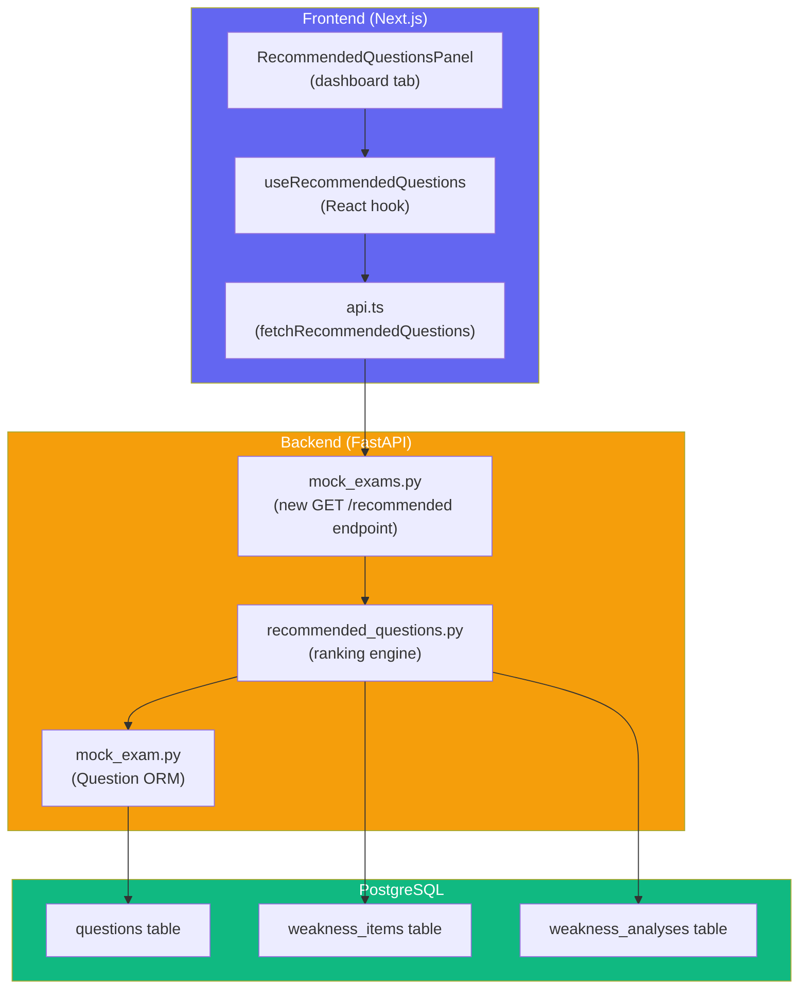
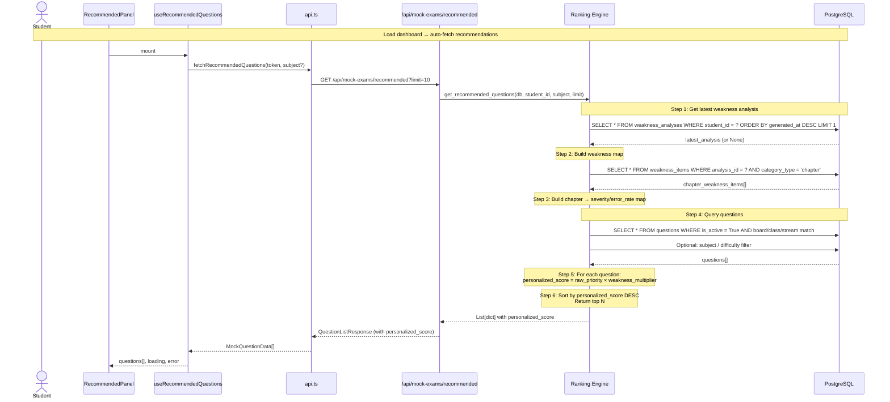
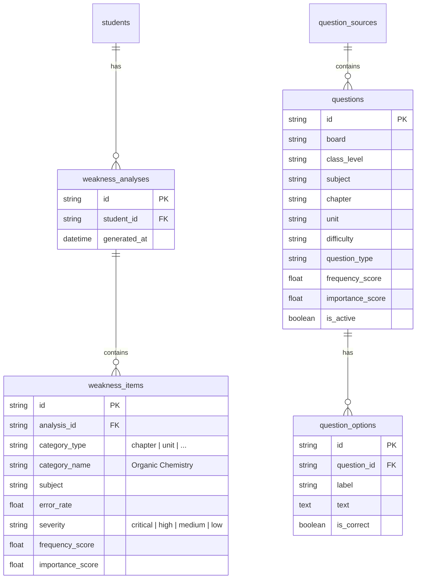
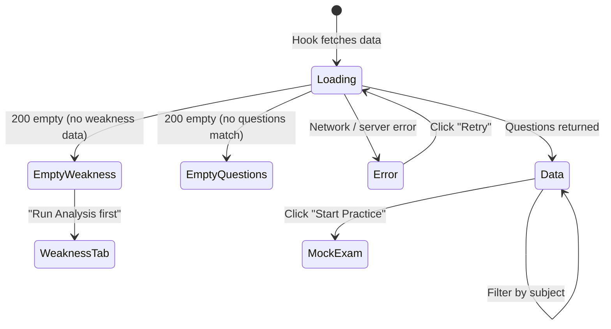
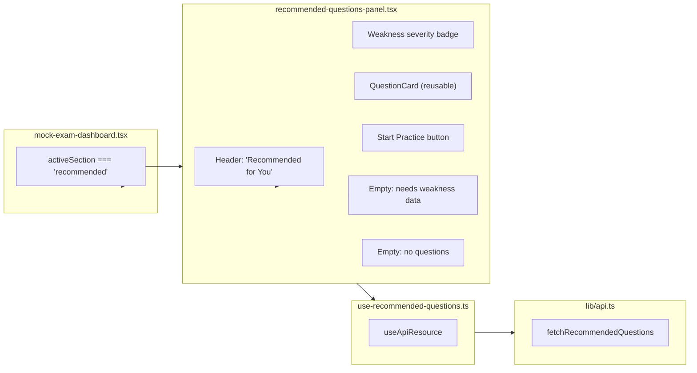
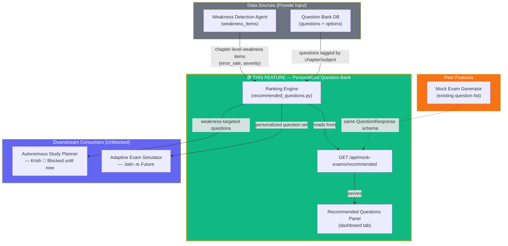
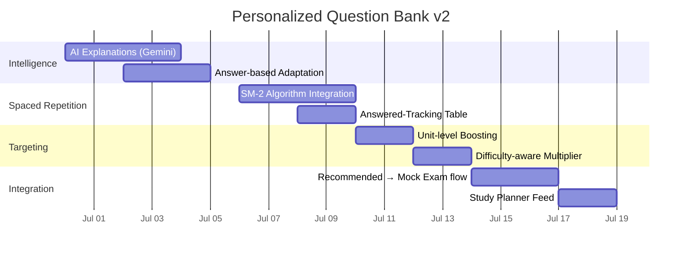

# Personalized Question Bank

> **Owner:** Krish  
> **Status:** v1 — Planning  
> **Next:** v2 — Spaced repetition, difficulty adaptation, AI explanations

---

## Table of Contents

1. [What It Does](#what-it-does)
2. [Architecture Overview](#architecture-overview)
3. [Ranking Algorithm](#ranking-algorithm)
4. [Data Model](#data-model)
5. [API Reference](#api-reference)
6. [Frontend Panel](#frontend-panel)
7. [Interaction With Other Modules](#interaction-with-other-modules)
8. [V2 Roadmap](#v2-roadmap)
9. [Edge Cases Handled](#edge-cases-handled)

---

## What It Does

The Personalized Question Bank uses a student's **weakness analysis data** to recommend questions that target their specific learning gaps. Instead of showing every student the same questions, it:

| Question | Answer |
|----------|--------|
| Which questions should I practice? | Questions from chapters you're weakest at, ranked by exam importance |
| Why this question? | "Recommended because you struggled in Electrostatics (high severity)" |
| Does it skip strong chapters? | No — strong chapters get baseline ranking, weak chapters get boosted |
| Does it change over time? | Yes — re-run weakness analysis → recommendations update automatically |

### v1 Capabilities

- **Backend recommendation engine** — computes personalized priority scores from weakness × question metadata
- **1 new REST endpoint** — `GET /api/mock-exams/recommended`
- **No new tables** — all data is computed on read from existing `weakness_items` + `questions`
- **Smart ranking** — weak chapters get 1.1x–1.5x boost, strong chapters stay at baseline
- **Optional filters** — by subject, difficulty, and limit
- **Frontend panel** — dashboard tab showing recommended questions with weakness context badges
- **Fallback behavior** — if no weakness data exists, behaves exactly like the generic question list

---

## Architecture Overview



### Request Flow



---

## Ranking Algorithm

### The Formula

```
personalized_score = raw_priority_score × weakness_multiplier

Where:
  raw_priority_score = frequency_score × 0.6 + importance_score × 0.4
```

### Weakness Multiplier Table

| Severity | error_rate Range | Multiplier | Meaning |
|----------|-----------------|-----------|---------|
| **critical** | ≥ 0.80 (80%) | **1.5** (50% boost) | Foundational concepts missing — practice urgently needed |
| **high** | ≥ 0.60 (60%) | **1.3** (30% boost) | Significant gaps — should practice |
| **medium** | ≥ 0.40 (40%) | **1.1** (10% boost) | Moderate weakness — good to practice |
| **low** | < 0.40 (40%) | **1.0** (no boost) | Generally strong — maintenance practice |
| **not in weakness data** | — | **1.0** (no boost) | No data yet — treat as baseline |

### Why This Formula

1. **Multiplicative, not additive**: A 1.5× boost doubles the effective priority (since raw scores are ~0.3–0.95 range). Additive boosts would be too small to matter.
2. **Capped at 1.5×**: Prevents weak chapters from completely hiding other content. Students also need maintenance practice.
3. **Smooth falloff**: Critical → high → medium → low gives graduated priority, not a hard cutoff.
4. **No data = no penalty**: Chapters not in the weakness analysis default to 1.0×, not 0×. This means new content still appears.

### Worked Example

```
Student's Weakness Data:
  - Electrostatics (physics): error_rate=0.75, severity="high" → multiplier = 1.3
  - Thermodynamics (physics): error_rate=0.85, severity="critical" → multiplier = 1.5
  - Optics (physics): error_rate=0.20, severity="low" → multiplier = 1.0

Question A: "Coulomb's Law" (Electrostatics, freq=0.8, imp=0.9)
  raw = 0.8×0.6 + 0.9×0.4 = 0.48 + 0.36 = 0.84
  personalized = 0.84 × 1.3 = 1.092

Question B: "Heat Engines" (Thermodynamics, freq=0.6, imp=0.7)
  raw = 0.6×0.6 + 0.7×0.4 = 0.36 + 0.28 = 0.64
  personalized = 0.64 × 1.5 = 0.96

Question C: "Refraction" (Optics, freq=0.9, imp=0.85)
  raw = 0.9×0.6 + 0.85×0.4 = 0.54 + 0.34 = 0.88
  personalized = 0.88 × 1.0 = 0.88  // no boost since Optics is "low" severity

Ranking: A (1.092) > B (0.96) > C (0.88)
```

---

## Data Model

### No New Tables

The Personalized Question Bank uses **existing tables only**:



### Data Flow

```
Weakness Items (per student)
  │
  ├── category_type = "chapter"  →  chapter name → severity multiplier
  │
  ▼
Questions (global bank)
  │
  ├── chapter  →  match weakness chapter
  ├── board/class/stream  →  match student profile
  ├── is_active = True  →  filter out deprecated
  │
  ▼
Ranking Engine
  │
  ├── personalized_score = raw_priority × weakness_multiplier
  ├── SORT DESC
  ├── LIMIT N
  │
  ▼
Recommended Questions (response)
```

---

## API Reference

### `GET /api/mock-exams/recommended`

Get personalized recommended questions based on the student's latest weakness analysis.

**Auth:** Clerk JWT (Bearer token)

**Query Parameters:**

| Param | Type | Default | Description |
|-------|------|---------|-------------|
| `subject` | string | — | Filter by subject (physics / chemistry / biology) |
| `difficulty` | string | — | Filter by difficulty (Easy / Medium / Hard) |
| `limit` | int | 10 | Max questions to return (min 1, max 50) |

**Response `200`:**
```json
{
  "questions": [
    {
      "id": "uuid",
      "board": "CBSE",
      "class_level": "12th",
      "stream": "science",
      "subject": "physics",
      "chapter": "Electrostatics",
      "unit": "Coulomb's Law",
      "question_number": "1",
      "question_type": "mcq",
      "text": "Two point charges +2μC and -2μC are placed...",
      "expected_answer": null,
      "marks": 4,
      "difficulty": "Medium",
      "frequency_score": 0.85,
      "importance_score": 0.9,
      "priority_score": 0.87,
      "personalized_score": 1.13,
      "source_year": 2023,
      "options": [
        { "id": "opt1", "label": "A", "text": "0.5 N attractive", "is_correct": false, "display_order": 0 },
        { "id": "opt2", "label": "B", "text": "0.5 N repulsive", "is_correct": false, "display_order": 1 },
        { "id": "opt3", "label": "C", "text": "1.0 N attractive", "is_correct": true, "display_order": 2 },
        { "id": "opt4", "label": "D", "text": "1.0 N repulsive", "is_correct": false, "display_order": 3 }
      ]
    }
  ]
}
```

**Response (no weakness data):** Same shape, but `personalized_score` will match `priority_score` for all questions (no boost applied).

**Response (not enough data):** Returns whatever questions match — minimum 0 if no questions found.

---

## Frontend Panel

### States



### Panel Layout

```
┌─────────────────────────────────────────────────┐
│  Recommended for You                     [↻]    │
│  Based on your latest weakness analysis          │
├─────────────────────────────────────────────────┤
│ ┌─────────────────────────────────────────────┐ │
│ │ Question 1: Two point charges...            │ │
│ │ 📘 Electrostatics • physics   🟠 High       │ │
│ │ 🔴 From your critical chapter               │ │
│ │ [Medium] [MCQ] [4 marks]                    │ │
│ └─────────────────────────────────────────────┘ │
│ ┌─────────────────────────────────────────────┐ │
│ │ Question 2: Heat engines operating...       │ │
│ │ 📗 Thermodynamics • physics   🔴 Critical   │ │
│ │ 🎯 Recommended because you need practice    │ │
│ │ [Hard] [MCQ] [5 marks]                      │ │
│ └─────────────────────────────────────────────┘ │
│ ┌─────────────────────────────────────────────┐ │
│ │ Question 3: A convex lens of focal...       │ │
│ │ 📙 Optics • physics   🟢 Low                │ │
│ │ [Easy] [MCQ] [1 mark]                       │ │
│ └─────────────────────────────────────────────┘ │
│                                                 │
│ [▶ Start Practice with 10 Questions]            │
└─────────────────────────────────────────────────┘
```

### Empty States

**No weakness data yet:**
```
┌─────────────────────────────────────────────┐
│       🧠 No weakness analysis yet            │
│  Run a weakness analysis first to get        │
│  personalized question recommendations.      │
│                                              │
│              [Go to Weakness Tab]             │
└─────────────────────────────────────────────┘
```

**No matching questions:**
```
┌─────────────────────────────────────────────┐
│       📚 No questions match filters          │
│  Try a different subject or check back      │
│  after more questions are added.             │
└─────────────────────────────────────────────┘
```

### Component Tree



---

## Interaction With Other Modules



### How Each Module Interacts

| Module | Relationship | What Data Flows |
|--------|-------------|-----------------|
| **Weakness Detection Agent** | **Primary data source** | `weakness_items` with `category_type='chapter'`, `severity`, `error_rate`, `importance_score` |
| **Question Bank DB** | **Secondary data source** | All active `questions` filtered by board/class/stream/subject; question metadata for ranking |
| **Mock Exam Generator** | **Peer module** | Shares the same `QuestionResponse` schema; both return the same shape |
| **Autonomous Study Planner** (Krish) | **Consumer (blocked)** | Needs recommended questions by weakness area to include in daily study plans |
| **Adaptive Exam Simulator** (Jatin) | **Consumer (future)** | Could use personalized scores as priors for adaptive difficulty selection |

---

## V2 Roadmap

### V2 — Spaced Repetition, Difficulty Adaptation, AI Explanations



| Feature | v1 | v2 |
|---------|----|----|
| **Ranking** | Fixed multipliers by severity category | Dynamic multiplier based on exact error_rate (smooth curve) |
| **Spaced repetition** | None | SM-2 algorithm to re-show questions at optimal intervals |
| **Answered tracking** | Not tracked | New `question_review_log` table tracks every answer |
| **Difficulty adaptation** | Static multiplier | Boost hard questions more for weak chapters if error_rate is high on Hard |
| **Explanations** | None | Gemini generates "Why this question helps you" description |
| **Unit-level boost** | Not supported | Boost questions from specific weak units within a chapter |
| **Mock exam integration** | Manual "Start Practice" button | One-click "Create Mock Exam from Recommendations" |

### V2 Feature Breakdown

#### 1. AI Explanations (Gemini)
Replace the generic "From your critical chapter" badge with Gemini-generated context:
> "You got 7 of 10 questions wrong in Electrostatics. This question tests Coulomb's Law, where you most often selected 'repulsive' instead of 'attractive.' Practice this to build intuition for force direction."

#### 2. Spaced Repetition (SM-2)
Add a `question_review_log` table tracking each time a student answers a recommended question:
```sql
CREATE TABLE question_review_log (
    id VARCHAR(36) PRIMARY KEY,
    student_id VARCHAR(36) NOT NULL REFERENCES students(id),
    question_id VARCHAR(36) NOT NULL REFERENCES questions(id),
    ease_factor FLOAT DEFAULT 2.5,
    interval_days INTEGER DEFAULT 0,
    repetitions INTEGER DEFAULT 0,
    next_review_at TIMESTAMP,
    last_answered_at TIMESTAMP,
    last_was_correct BOOLEAN
);
```
Then skip questions whose `next_review_at` is in the future, and boost questions that are due for review.

#### 3. Unit-Level Boosting
If weakness analysis has `category_type='unit'` items, extract the unit name and give questions from that unit an additional multiplier (e.g., 1.2× within an already-boosted chapter).

#### 4. Difficulty-Aware Multiplier
If the student's `difficulty` weakness items show `error_rate > 0.6` on "Hard" questions, add a difficulty multiplier:
```
question_multiplier = chapter_multiplier + (hard_weakness_penalty if question.difficulty == "Hard")
```

---

## Edge Cases Handled

| Scenario | How It's Handled |
|----------|-----------------|
| **No weakness analysis exists** | Fall back to raw `priority_score` — works exactly like current generic question list |
| **Weakness analysis has no chapter-type items** | Fall back to raw priority — no boost applied |
| **Student with no questions matching profile** | Return empty `{ questions: [] }` — frontend shows "No questions match" empty state |
| **Chapter name mismatch between weakness and question tags** | Questions not matched to any weakness chapter → multiplier stays at 1.0 (no boost, no crash) |
| **Partial weakness data** (only some chapters analyzed) | Matched chapters get boosts; unmatched chapters stay at 1.0 |
| **All questions from weak chapters already answered** | v1 still returns them; v2 with SM-2 will filter based on review log |
| **Concurrent requests** | Stateless read — no DB writes, no locking needed |
| **Student changes board/class/stream** | Questions filtered by new profile; weakness analysis from old profile may misalign — prompt re-analysis |
| **Outdated weakness analysis** (months old) | Boosts are still applied; no automatic expiration in v1 (v2 can add freshness decay) |
| **Large question bank** (1000+ questions) | Computation is O(N) with N = questions matching profile. Sorting 1000 items is ~5ms. No pagination needed for v1. |
| **Limit parameter edge cases** | `limit=0` clamped to 1; `limit>50` clamped to 50 |
| **Missing subject/difficulty filters** | No filter = all subjects/all difficulties returned. Default `limit=10` |

---

## Files Reference

### Backend

| File | Change | Purpose |
|------|--------|---------|
| `backend/app/schemas/mock_exam.py` | **MODIFIED** | Add `personalized_score` to `QuestionResponse` |
| `backend/app/services/recommended_questions.py` | **NEW** | Core ranking engine: weakness lookup, multiplier computation, question scoring |
| `backend/app/routes/mock_exams.py` | **MODIFIED** | Add `GET /api/mock-exams/recommended` endpoint |

### Frontend

| File | Change | Purpose |
|------|--------|---------|
| `frontend/lib/api.ts` | **MODIFIED** | Add `RecommendedQuestionData` interface + `fetchRecommendedQuestions` function |
| `frontend/hooks/use-recommended-questions.ts` | **NEW** | React hook with loading/error/data states |
| `frontend/components/dashboard/recommended-questions-panel.tsx` | **NEW** | Panel component: question cards, weakness badges, empty states |
| `frontend/components/dashboard/mock-exam-dashboard.tsx` | **MODIFIED** | Wire "recommended" tab |

---

## Verification

| Check | Expected |
|-------|----------|
| `python -m compileall app` | ✅ All backend files compile |
| `npm run lint` (tsc --noEmit) | ✅ Zero TypeScript errors |
| `npm run build` (Next.js production) | ✅ Build succeeds |
| Backend API test (curl) | `GET /api/mock-exams/recommended` returns valid `QuestionListResponse` |
| Fallback test | Student with no weakness data → returns questions without `personalized_score` being null |
| Boost correctness | Questions from `severity='critical'` chapters appear before `severity='low'` chapters |
| Filter correctness | `?subject=physics` returns only physics questions |
| Limit correctness | `?limit=5` returns 5 or fewer questions |

---

*For implementation details, see `task-ticket-personalized-question-bank.md` in the repository.*
