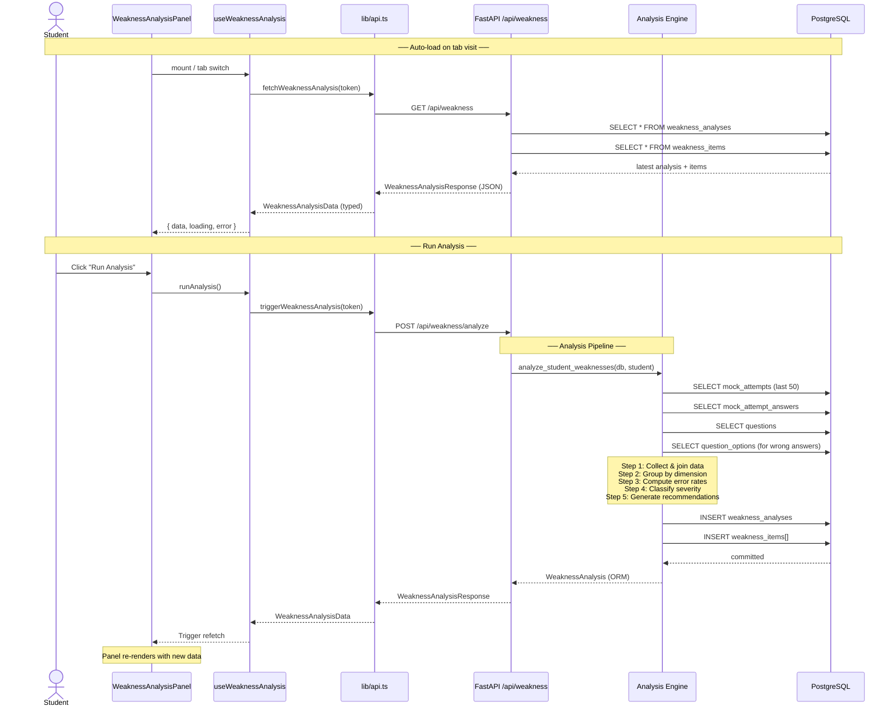
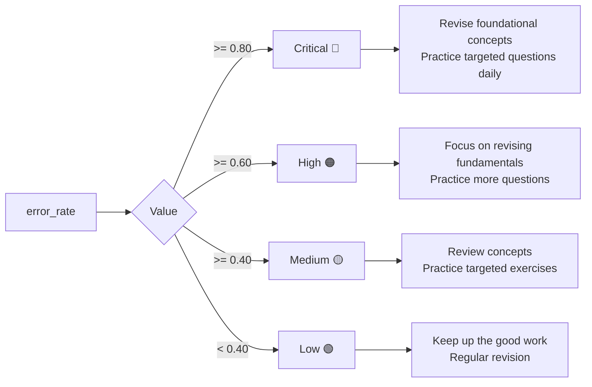
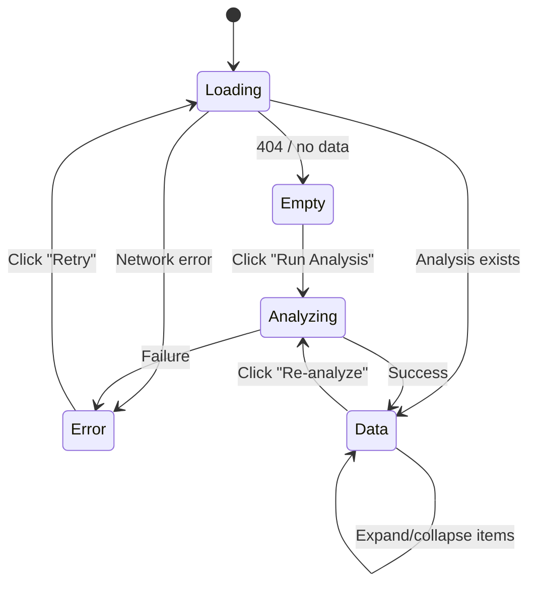
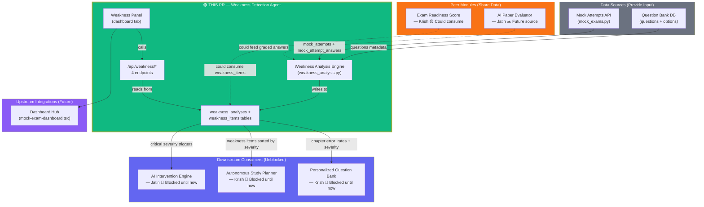
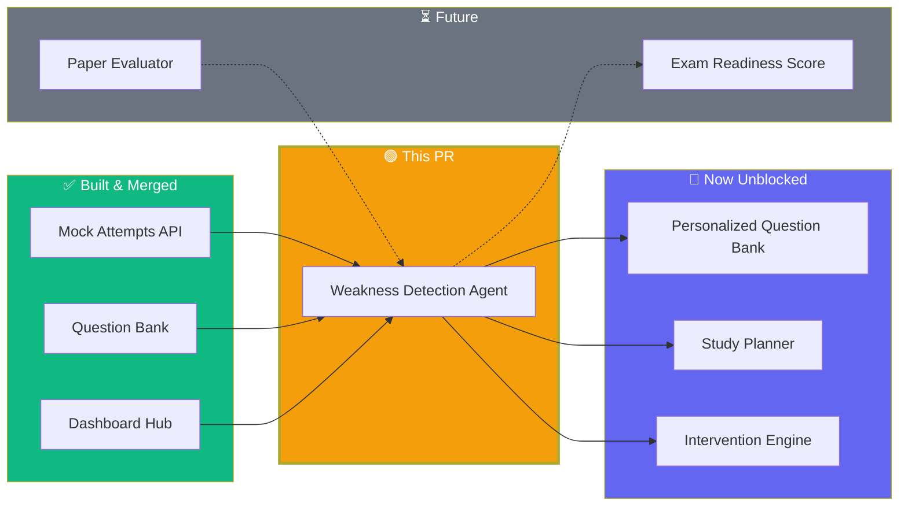
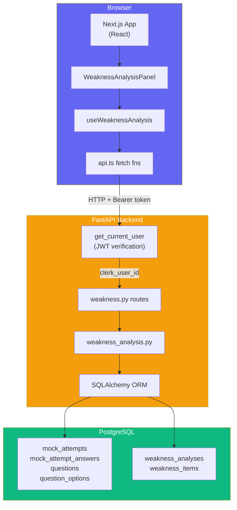
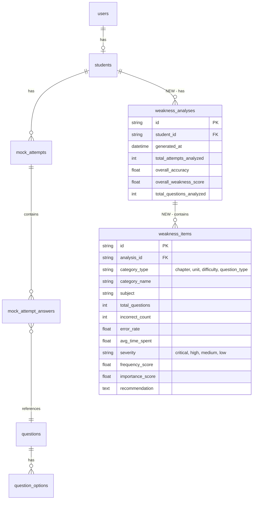
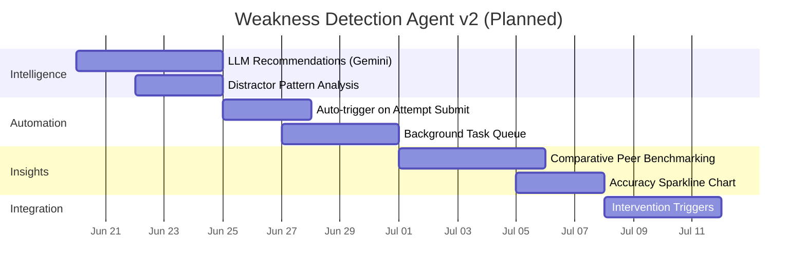
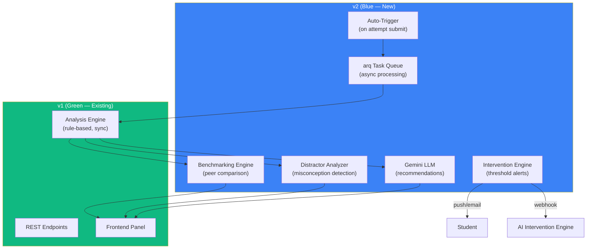

# Pull Request: Weakness Detection Agent — v1

> **Branch:** `feat/weakness-detection-agent` → `main`  
> **Owner:** Krish  
> **Status:** Ready for review

---

## Table of Contents

1. [What This PR Does](#1-what-this-pr-does)
2. [Why v1 (Not v2)](#2-why-v1-not-v2)
3. [How The Current System Works](#3-how-the-current-system-works)
4. [How Other Modules Interact With This](#4-how-other-modules-interact-with-this)
5. [Architecture Deep Dive](#5-architecture-deep-dive)
6. [Data Model](#6-data-model)
7. [API Reference](#7-api-reference)
8. [Files Changed](#8-files-changed)
9. [Verification](#9-verification)
10. [V2 Roadmap](#10-v2-roadmap)
11. [Edge Cases Handled](#11-edge-cases-handled)

---

## 1. What This PR Does

The Weakness Detection Agent analyzes a student's mock attempt answers to **identify learning gaps** across multiple dimensions, **classify their severity**, and **generate actionable recommendations**.

### Before This PR

Students completed mock exams and saw only their score percentage. There was **no analysis layer** — no insight into *which* chapters they're weak at, *why* they got questions wrong, or *what* to study next.

Downstream features were blocked:
- **Personalized Question Bank** (Krish) — cannot recommend questions without knowing weak areas
- **Autonomous Study Planner** (Krish) — cannot build plans without weakness data
- **AI Intervention Engine** (Jatin) — cannot trigger interventions without severity signals

### After This PR

| Question | Answer |
|----------|--------|
| Which chapters are weakest? | Chapter-level error rates, sorted by severity |
| Does difficulty matter? | Easy vs Medium vs Hard error rate breakdown |
| MCQ vs Theory performance? | Per-question-type accuracy |
| Time efficiency? | Average time spent on correct vs incorrect answers |
| What matters for exams? | Frequency and importance scores from PYQ data |
| What to study next? | Rule-based recommendations per weak area |

---

## 2. Why v1 (Not v2)

This is an **MVP** built under time constraints. The goal was to ship a working analysis layer that unblocks downstream features as fast as possible.

### Design Principles of v1

| Principle | Meaning |
|-----------|---------|
| **Rule-based** | All logic is deterministic — no LLM, no external API calls |
| **Synchronous** | Analysis runs in the same request — no queue, no workers |
| **Manually triggered** | User clicks "Run Analysis" — no auto-trigger infrastructure |
| **Persistent** | Results stored in PostgreSQL — survives restarts, enables history |
| **Zero dependencies** | No Redis, no Gemini, no Celery, no external services |

### Why These Choices Matter

| Concern | v1 Rule-Based | v2 LLM-Powered |
|---------|---------------|-----------------|
| Latency | ~100ms (same request) | ~3-5s (Gemini API call) |
| Cost | $0 | ~$0.003 per analysis (Gemini) |
| Debuggability | Deterministic, easy to reproduce | Non-deterministic, hard to test |
| Infrastructure | Nothing extra | Need Redis + worker + API keys |
| Reliability | Always works, no external dependency | Depends on API availability |

### What v2 Features Were Cut and Why

| Feature | Why Cut From v1 |
|---------|----------------|
| **LLM recommendations** | Needs Gemini integration, prompt engineering, cost analysis, fallback logic |
| **Auto-trigger on attempt submit** | Needs background task queue or FastAPI BackgroundTasks + dedup logic |
| **Comparative benchmarking** | Needs multi-tenant data + aggregation cron + percentile computation |
| **Distractor analysis** | Needs real usage data to validate which distractor patterns matter |
| **Intervention triggers** | Depends on AI Intervention Engine which is not built yet |
| **Sparkline chart** | Needs a chart library or custom SVG — nice-to-have, not blocking |

All v2 details are documented in the `WEAKNESS_DETECTION_AGENT.md` companion document.

---

## 3. How The Current System Works

### 3.1 High-Level Flow

```mermaid
flowchart TB
    subgraph UserJourney["User Journey"]
        A[Student completes<br/>mock exam] --> B[Navigates to<br/>dashboard]
        B --> C[Clicks Weakness tab]
        C --> D{Analysis exists?}
        D -->|No| E[Clicks<br/>"Run Analysis"]
        D -->|Yes| F[Views weaknesses<br/>and recommendations]
        E --> G[Analysis runs<br/>~100ms]
        G --> F
        F --> H[Clicks<br/>"Re-analyze"]
        H --> G
    end
```

### 3.2 Request Flow (Detailed)



### 3.3 Analysis Pipeline (Inside the Engine)

```
analyze_student_weaknesses(db, student)
│
├─ 1. Fetch Data
│   ├── mock_attempts WHERE student_id = ? AND status = 'submitted'
│   │     ORDER BY submitted_at DESC LIMIT 50
│   ├── mock_attempt_answers WHERE attempt_id IN (...)
│   ├── questions WHERE id IN (question_ids)
│   └── question_options WHERE id IN (wrong_option_ids)
│
├─ 2. Collect Answer Data
│   └── For each answer, build dict with:
│       ├── is_correct, time_spent_seconds, score_awarded
│       ├── subject, chapter, unit (from Question)
│       ├── difficulty, question_type (from Question)
│       ├── frequency_score, importance_score (from Question)
│       └── wrong_option_label (from QuestionOption, if wrong)
│
├─ 3. Compute Overall Stats
│   ├── total_questions = len(answer_data)
│   ├── correct_count = count(is_correct == True)
│   ├── incorrect_count = count(is_correct == False)
│   ├── overall_accuracy = correct_count / total_questions
│   └── overall_weakness_score = incorrect_count / total_questions
│
├─ 4. Compute Per-Dimension Metrics (for each of 4 dimensions)
│   ├── For each unique value in the dimension:
│   │   ├── error_rate = incorrect / (incorrect + correct)
│   │   ├── avg_time = AVG(time_spent_seconds) [if not null]
│   │   ├── severity = classify(error_rate)
│   │   └── recommendation = generate(category, error_rate)
│   └── Dimensions:
│       ├── chapter (e.g., "Organic Chemistry")
│       ├── unit (e.g., "Hydrocarbons")
│       ├── difficulty ("Easy", "Medium", "Hard")
│       └── question_type ("mcq", "theory")
│
└─ 5. Persist & Return
    ├── INSERT INTO weakness_analyses (...)
    ├── INSERT INTO weakness_items (...) for each item
    └── Return WeaknessAnalysis with items loaded
```

### 3.4 Severity Classification



### 3.5 Frontend Panel States



**Empty state:**
```
┌─────────────────────────────────────────────┐
│             🧠 No analysis yet               │
│   Run a weakness analysis to identify your   │
│   learning gaps from mock exam attempts.     │
│                                              │
│          [ 🔄 Run Analysis ]                 │
└─────────────────────────────────────────────┘
```

**Data state:**
```
┌─────────────────────────────────────────────────┐
│  Last analysis: 6/14/2026, 2:30 PM  [Re-analyze]│
├─────────────────────────────────────────────────┤
│ ┌──────────┐ ┌──────────┐ ┌──────────┐ ┌──────┐│
│ │Weak Score│ │ Accuracy │ │Attempts  │ │Q's   ││
│ │    28    │ │   72%    │ │    5     │ │  50  ││
│ │Mod gaps  │ │All mock  │ │Recent    │ │Total ││
│ └──────────┘ └──────────┘ └──────────┘ └──────┘│
├─────────────────────────────────────────────────┤
│  Accuracy ████████████████░░░░░░░░░  72%         │
├─────────────────────────────────────────────────┤
│ ⚠ Priority Weaknesses (3)                        │
│ ┌─────────────────────────────────────────────┐ │
│ │ Organic Chemistry         🔴 high  7/10 wrong│ │
│ │   ▶ Expanded:                                │ │
│ │     Error rate: 70%                          │ │
│ │     Avg time: 85s                            │ │
│ │     Subject: chemistry                       │ │
│ │     💡 Focus on revising Organic Chemistry   │ │
│ │        fundamentals...                       │ │
│ └─────────────────────────────────────────────┘ │
│ ┌─────────────────────────────────────────────┐ │
│ │ Electrostatics           🟠 high  6/8 wrong │ │
│ └─────────────────────────────────────────────┘ │
│ ┌─────────────────────────────────────────────┐ │
│ │ Hard questions           🟡 medium 5/9 wrong│ │
│ └─────────────────────────────────────────────┘ │
└─────────────────────────────────────────────────┘
```

---

## 4. How Other Modules Interact With This

### 4.1 Complete Module Interaction Map



### 4.2 Detailed Interaction Per Module

#### Mock Attempts API (Data Source)

**Relationship:** Primary data provider  
**What flows:** All `mock_attempt_answers` rows with `is_correct`, `time_spent_seconds`, `selected_option_id`  
**How:** The analysis engine queries `mock_attempts` filtered by `student_id` and joins with `mock_attempt_answers`  
**Contract:** Must have at least one attempt with `status = 'submitted'` for analysis to produce results

```python
# In weakness_analysis.py
attempts = db.query(MockAttempt).filter(
    MockAttempt.student_id == student.id,
    MockAttempt.status == "submitted",
).order_by(desc(MockAttempt.submitted_at)).limit(50).all()
```

#### Question Bank (Data Source)

**Relationship:** Metadata provider  
**What flows:** `questions.chapter`, `questions.unit`, `questions.difficulty`, `questions.question_type`, `questions.frequency_score`, `questions.importance_score`  
**How:** The engine joins `mock_attempt_answers.question_id → questions.id` to enrich each answer with classification metadata  
**Contract:** Questions must exist and be `is_active = True` to be included; inactive questions are skipped

#### Dashboard UI (Consumer)

**Relationship:** Visual consumer  
**What flows:** `WeaknessAnalysisData` → rendered as metric cards, severity badges, expandable item list  
**How:** `mock-exam-dashboard.tsx` imports `WeaknessAnalysisPanel` + `useWeaknessAnalysis` hook, renders conditionally when `activeSection === "weakness"`  
**Also:** "Weak Concepts" metric card in the dashboard hero section uses `weaknessData.items` count (critical/high items)

```tsx
// In mock-exam-dashboard.tsx
const weaknessCount = weaknessData?.items
  ? weaknessData.items.filter((i) => i.severity === "critical" || i.severity === "high").length
  : null;
```

#### Personalized Question Bank — Krish (Consumer, Blocked)

**Relationship:** **Unblocked by this PR**  
**What it needs:** `weakness_items` where `category_type = "chapter"` and `severity = "high" | "critical"`  
**How it would consume:**

```python
# Future — in Personalized Question Bank service
weak_chapters = db.query(WeaknessItem).filter(
    WeaknessItem.analysis_id == latest_analysis.id,
    WeaknessItem.category_type == "chapter",
    WeaknessItem.severity.in_(["high", "critical"]),
).all()
# → recommend questions targeting these chapters
```

**Before this PR:** Blocked — no weakness data existed  
**After this PR:** Can start implementation using `GET /api/weakness/items?category_type=chapter&severity=high`

#### Autonomous Study Planner — Krish (Consumer, Blocked)

**Relationship:** **Unblocked by this PR**  
**What it needs:** Full list of `weakness_items` ordered by `error_rate * importance_score` desc  
**How it would consume:**

```python
# Future — in Study Planner service
weakness_items = db.query(WeaknessItem).filter(
    WeaknessItem.analysis_id == latest_analysis.id,
).order_by(
    (WeaknessItem.error_rate * WeaknessItem.importance_score).desc()
).all()
# → build study plan topics prioritized by weakness severity × exam importance
```

**Before this PR:** Blocked — no weakness data existed  
**After this PR:** Can start implementation using `GET /api/weakness/items`

#### AI Intervention Engine — Jatin (Consumer, Blocked)

**Relationship:** **Unblocked by this PR**  
**What it needs:** `WeaknessItem` records with `severity = "critical"`  
**How it would consume:**

```python
# Future — in Intervention Engine
critical_items = db.query(WeaknessItem).filter(
    WeaknessItem.analysis_id == latest_analysis.id,
    WeaknessItem.severity == "critical",
).all()
if len(critical_items) >= 3:
    trigger_mentor_alert(student)
```

#### Exam Readiness Score — Krish (Peer)

**Relationship:** Could consume weakness data for live weak_chapters (currently hardcoded)  
**Current state:** `ExamReadiness` model has `weak_chapters` as a JSON/text field populated manually  
**Future state:** Could replace hardcoded `weak_chapters` with live query:

```python
# Future improvement in readiness.py
weakness_items = db.query(WeaknessItem).filter(
    WeaknessItem.analysis_id == latest_analysis.id,
    WeaknessItem.category_type == "chapter",
).order_by(WeaknessItem.error_rate.desc()).all()
readiness.weak_chapters = [item.category_name for item in weakness_items if item.severity in ("high", "critical")]
```

#### AI Paper Evaluator — Jatin (Future Source)

**Relationship:** Future data provider for theory-question weakness analysis  
**Current state:** Not built yet  
**Future state:** Graded theory answers from uploaded PDFs would feed `is_correct` and `score_awarded` into the same `mock_attempt_answers` pipeline, making weakness analysis work for non-MCQ questions too

### 4.3 Dependency Graph



---

## 5. Architecture Deep Dive

### 5.1 System Architecture



### 5.2 File Map

```
backend/
├── migrations/
│   └── 005_add_weakness_analysis.sql          # NEW — DB schema
├── app/
│   ├── models/
│   │   ├── __init__.py                        # MODIFIED — added exports
│   │   ├── student.py                         # MODIFIED — added relationship
│   │   └── weakness.py                        # NEW — ORM classes
│   ├── schemas/
│   │   └── weakness.py                        # NEW — Pydantic models
│   ├── services/
│   │   └── weakness_analysis.py               # NEW — Analysis engine
│   ├── routes/
│   │   └── weakness.py                        # NEW — 4 endpoints
│   └── main.py                                # MODIFIED — registered router

frontend/
├── lib/
│   └── api.ts                                 # MODIFIED — added types + fns
├── hooks/
│   └── use-weakness-analysis.ts               # NEW — React hook
└── components/
    └── dashboard/
        ├── weakness-analysis-panel.tsx         # NEW — Panel component
        └── mock-exam-dashboard.tsx             # MODIFIED — wired weakness tab
```

### 5.3 Key Design Decisions

| Decision | v1 Choice | Rationale |
|----------|-----------|-----------|
| Analysis storage | Separate tables (not computed on read) | Enables history, comparison, caching; avoids re-querying all attempts on every page load |
| Trigger model | Manual ("Run Analysis" button) | Simplest implementation; can add auto-trigger in v2 |
| Recommendations | Rule-based (no LLM) | Deterministic, zero cost, testable, no external dependency |
| Severity thresholds | 80/60/40 breakpoints | Matches common academic grading intuition |
| Panel placement | Dashboard tab (same as Health + Readiness) | Consistent UX pattern — users know where to find dashboard features |
| Auth | Clerk JWT via `get_current_user` | Same as all other routes; no new auth infrastructure |
| Max attempts analyzed | 50 most recent | Covers enough data for meaningful analysis without performance risk |
| Error handling | Rollback on failure + 500 response | Matches existing pattern in mock_exams.py |

---

## 6. Data Model

### 6.1 New Tables

```sql
-- Migration 005: Weakness Analysis Tables

CREATE TABLE IF NOT EXISTS weakness_analyses (
    id VARCHAR(36) PRIMARY KEY,
    student_id VARCHAR(36) NOT NULL REFERENCES students(id),
    generated_at TIMESTAMP NOT NULL DEFAULT CURRENT_TIMESTAMP,
    total_attempts_analyzed INTEGER NOT NULL DEFAULT 0,
    overall_accuracy FLOAT NOT NULL DEFAULT 0,
    overall_weakness_score FLOAT NOT NULL DEFAULT 0,
    total_questions_analyzed INTEGER NOT NULL DEFAULT 0
);

CREATE INDEX IF NOT EXISTS ix_weakness_analyses_student_id
    ON weakness_analyses (student_id);

CREATE TABLE IF NOT EXISTS weakness_items (
    id VARCHAR(36) PRIMARY KEY,
    analysis_id VARCHAR(36) NOT NULL REFERENCES weakness_analyses(id),
    category_type VARCHAR NOT NULL,       -- 'chapter' | 'unit' | 'difficulty' | 'question_type'
    category_name VARCHAR NOT NULL,       -- e.g., 'Organic Chemistry', 'Hard', 'mcq'
    subject VARCHAR NOT NULL,
    total_questions INTEGER NOT NULL DEFAULT 0,
    incorrect_count INTEGER NOT NULL DEFAULT 0,
    error_rate FLOAT NOT NULL DEFAULT 0,  -- 0.0 to 1.0
    avg_time_spent FLOAT,                 -- seconds, nullable
    severity VARCHAR NOT NULL DEFAULT 'medium',  -- 'critical' | 'high' | 'medium' | 'low'
    frequency_score FLOAT DEFAULT 0,
    importance_score FLOAT DEFAULT 0,
    recommendation TEXT
);

CREATE INDEX IF NOT EXISTS ix_weakness_items_analysis_id
    ON weakness_items (analysis_id);
CREATE INDEX IF NOT EXISTS ix_weakness_items_category
    ON weakness_items (category_type, category_name);
CREATE INDEX IF NOT EXISTS ix_weakness_items_severity
    ON weakness_items (severity);
```

### 6.2 ER Diagram



---

## 7. API Reference

### `POST /api/weakness/analyze`

Trigger a fresh analysis. Computes all dimensions and persists results.

**Auth:** Clerk JWT (Bearer token)  
**Response `200`:**
```json
{
  "id": "a1b2c3d4-...",
  "generated_at": "2026-06-14T12:00:00",
  "total_attempts_analyzed": 5,
  "overall_accuracy": 0.72,
  "overall_weakness_score": 0.28,
  "total_questions_analyzed": 50,
  "items": [
    {
      "category_type": "chapter",
      "category_name": "Organic Chemistry",
      "subject": "chemistry",
      "total_questions": 10,
      "incorrect_count": 7,
      "error_rate": 0.7,
      "avg_time_spent": 85.3,
      "severity": "high",
      "frequency_score": 0.85,
      "importance_score": 0.9,
      "recommendation": "Focus on revising Organic Chemistry fundamentals. Practice more questions to improve understanding."
    }
  ]
}
```

### `GET /api/weakness`

Get the most recent analysis for the current student.

**Auth:** Clerk JWT (Bearer token)  
**Response `200`:** Same shape as `POST /analyze`  
**Response (no data):** Returns empty structure with `id: ""`, all zeros, empty items array

### `GET /api/weakness/items`

Get weakness items from the latest analysis, with optional filters.

**Query Parameters:**

| Param | Type | Description |
|-------|------|-------------|
| `severity` | string | Filter: `critical`, `high`, `medium`, `low` |
| `category_type` | string | Filter: `chapter`, `unit`, `difficulty`, `question_type` |

**Auth:** Clerk JWT (Bearer token)  
**Response `200`:** Array of WeaknessItemResponse objects

### `GET /api/weakness/trends`

Get per-attempt score trends over time.

**Query Parameters:**

| Param | Type | Default | Description |
|-------|------|---------|-------------|
| `subject` | string | — | Filter by subject |
| `limit` | int | 20 | Max attempts to return (1–100) |

**Auth:** Clerk JWT (Bearer token)  
**Response `200`:**
```json
{
  "trends": [
    {
      "attempt_id": "uuid",
      "subject": "physics",
      "chapter": "Electrostatics",
      "score_percentage": 65.0,
      "correct_count": 7,
      "total_questions": 10,
      "submitted_at": "2026-06-10T14:30:00"
    }
  ]
}
```

---

## 8. Files Changed

### New Files (7)

| File | Lines | Purpose |
|------|-------|---------|
| `backend/migrations/005_add_weakness_analysis.sql` | 35 | Creates `weakness_analyses` + `weakness_items` tables with indexes |
| `backend/app/models/weakness.py` | 67 | SQLAlchemy ORM classes with relationships |
| `backend/app/schemas/weakness.py` | 41 | Pydantic response models |
| `backend/app/services/weakness_analysis.py` | 301 | Core analysis engine — 6 dimensions, severity, recommendations |
| `backend/app/routes/weakness.py` | 215 | 4 REST endpoints |
| `frontend/hooks/use-weakness-analysis.ts` | 38 | React hook with auto-fetch + runAnalysis trigger |
| `frontend/components/dashboard/weakness-analysis-panel.tsx` | 356 | Panel component — 4 states, metric cards, expandable items |

### Modified Files (4)

| File | Change |
|------|--------|
| `backend/app/models/__init__.py` | Added `WeaknessAnalysis`, `WeaknessItem` exports |
| `backend/app/models/student.py` | Added `weakness_analyses` relationship |
| `backend/app/main.py` | Registered `weakness_router` |
| `frontend/lib/api.ts` | Added 4 interfaces + 4 fetch functions |
| `frontend/components/dashboard/mock-exam-dashboard.tsx` | Added weakness tab import, hook call, conditional rendering, dashboardStats integration |

---

## 9. Verification

### Backend Compilation

```
> python -m compileall -f app
Listing 'app'...
Compiling 'app/__init__.py'...
Compiling 'app/main.py'...
Compiling 'app/models/__init__.py'...
Compiling 'app/models/weakness.py'...
Compiling 'app/routes/weakness.py'...
Compiling 'app/schemas/weakness.py'...
Compiling 'app/services/weakness_analysis.py'...
...
✅ All 34 files compiled successfully (zero errors)
```

### Frontend TypeScript

```
> npm run lint
> tsc --noEmit
✅ Zero TypeScript errors
```

### Frontend Production Build

```
> npm run build
▲ Next.js 16.2.7 (Turbopack)
✓ Compiled successfully in 8.8s
✓ TypeScript check passed
✓ Static pages generated (6/6)
✅ Production build succeeds
```

### Commit History

```
4505d03 Wire WeaknessAnalysisPanel into dashboard as weakness tab
8a933a2 Add WeaknessAnalysisPanel component with severity breakdown
5665104 Add useWeaknessAnalysis hook with runAnalysis trigger
fddb701 Add weakness analysis types and API client functions
a734251 Add weakness analysis routes and register in main.py
dbe4ee9 Add weakness analysis engine with 6 analysis dimensions
c131223 Add weakness analysis Pydantic schemas
f3d4af5 Add WeaknessAnalysis and WeaknessItem ORM models
a7a9e20 Add migration 005: weakness_analyses and weakness_items tables
bc32465 Update roadmap: mark mock infra complete, add weakness detection entry
```

✅ 10 atomic commits, each with a single focused change  
✅ No "co-authored-by" or auto-generated messages  
✅ Each commit compiles independently  

---

## 10. V2 Roadmap

### What v2 Would Add



| Feature | v1 | v2 |
|---------|----|----|
| **Recommendations** | Rule-based templates | Gemini generates context-aware study tips from actual wrong answers |
| **Trigger** | Manual button click | Auto-runs after every mock attempt submission |
| **Execution** | Synchronous in request | Background task queue (arq + Redis) |
| **Benchmarking** | None | Peer percentile: "You're in bottom 20% for this chapter" |
| **Distractors** | Option IDs collected, not analyzed | "You picked Option B 60% of the time — common misconception" |
| **Charts** | CSS accuracy bar | SVG sparkline chart showing score trend over time |
| **Interventions** | None | Push notification on critical weakness; mentor alert at threshold |
| **Cost** | $0 | ~$0.003/analysis (Gemini API) |
| **Latency** | ~100ms | ~3-5s (moved to background) |

### v2 Architecture



---

## 11. Edge Cases Handled

| Scenario | How It's Handled | Code Location |
|----------|-----------------|---------------|
| **Student has zero attempts** | Returns empty analysis (`id: ""`, all zeros, empty items array) | `analyze_student_weaknesses()` — early return on empty attempts |
| **Partial `is_correct` data** | Only entries where `is_correct` is `True` or `False` are counted in error rate; null entries contribute to `total_questions` but not `error_rate` | `_build_weakness_item()` — `scorable = incorrect + correct` check |
| **Missing `time_spent_seconds`** | `avg_time_spent` is `null` for items where no entries have time data; computation filters nulls with list comprehension | `_build_weakness_item()` — `times = [e[...] for e in entries if e[...] is not None]` |
| **Deleted/inactive questions** | Answers referencing questions with `is_active = False` are excluded from analysis; attempt count remains accurate | `_collect_answer_data()` — `if not question: continue` skips inactive/deleted |
| **Multiple rapid "Analyze" clicks** | Each call creates a new `weakness_analyses` row; `GET /api/weakness` always returns latest by `generated_at DESC` | Routes always query `ORDER BY generated_at DESC LIMIT 1` |
| **Theory questions (no options)** | Distractor data is null; analysis still works on other dimensions (difficulty, question_type) | `_collect_answer_data()` — `wrong_options` dict is only populated for MCQs |
| **Concurrent analysis for same student** | Both succeed independently, creating two rows; reads always get the latest | No locking in v1 (safe for MVP, v2 will add dedup) |
| **Expired Clerk JWT mid-request** | `get_current_user` raises 401 before route executes; DB is never touched | `HTTPBearer(auto_error=False)` + manual 401 raise |
| **Only one attempt exists** | Analysis still runs, produces valid items; `total_attempts_analyzed = 1` | No minimum threshold for analysis |
| **All answers correct** | `overall_weakness_score = 0.0`, all items have `severity = "low"`, recommendations are positive | `_classify_severity(0.0)` returns `"low"` |
| **All answers wrong** | `overall_weakness_score = 1.0`, all items have `severity = "critical"`, recommendations are urgent | `_classify_severity(1.0)` returns `"critical"` |
| **Student ID not found** | `_get_current_student()` raises 404 with "User not found" or "Student not found" | Standard pattern from `mock_exams.py` |

---

*For full implementation details, see `WEAKNESS_DETECTION_AGENT.md` in the repository.*
