# Weakness Detection Agent

> **Owner:** Jatin  
> **Status:** v1 — Complete (branch: `feat/weakness-detection-agent`)  
> **Next:** v2 — LLM-powered recommendations + auto-trigger + comparative analysis

---

## Table of Contents

1. [What It Does](#what-it-does)
2. [Architecture Overview](#architecture-overview)
3. [Data Model](#data-model)
4. [API Reference](#api-reference)
5. [Analysis Dimensions](#analysis-dimensions)
6. [Severity Classification](#severity-classification)
7. [Frontend Panel](#frontend-panel)
8. [Interaction With Other Modules](#interaction-with-other-modules)
9. [V2 Roadmap](#v2-roadmap)
10. [Edge Cases Handled](#edge-cases-handled)

---

## What It Does

The Weakness Detection Agent analyzes a student's mock attempt answers across **six dimensions** to identify learning gaps, classify their severity, and generate actionable recommendations.

Instead of just showing "you scored 60%", it answers:

| Question | Answer |
|----------|--------|
| Which chapters are you weakest at? | Chapter-level error rates sorted by severity |
| Does difficulty matter? | Easy vs Medium vs Hard error rate breakdown |
| Are you better at MCQs or theory? | Per-question-type accuracy |
| How efficient is your time usage? | Average time spent on correct vs incorrect answers |
| What matters most for exams? | Frequency and importance scores from PYQ data |
| What should you study next? | Rule-based recommendations per weak area |

### v1 Capabilities

- **Backend analysis engine** — 6 analysis dimensions computed from `mock_attempt_answers` + `questions` tables
- **4 REST API endpoints** — trigger analysis, get results, filter items, get trends
- **Persistent storage** — `weakness_analyses` + `weakness_items` tables with full history
- **Severity classification** — critical / high / medium / low based on error rate thresholds
- **Rule-based recommendations** — deterministic study advice per category
- **Frontend panel** — dashboard tab with metric cards, accuracy bar, and expandable weakness items
- **Filterable items API** — query by severity or category type

---

## Architecture Overview

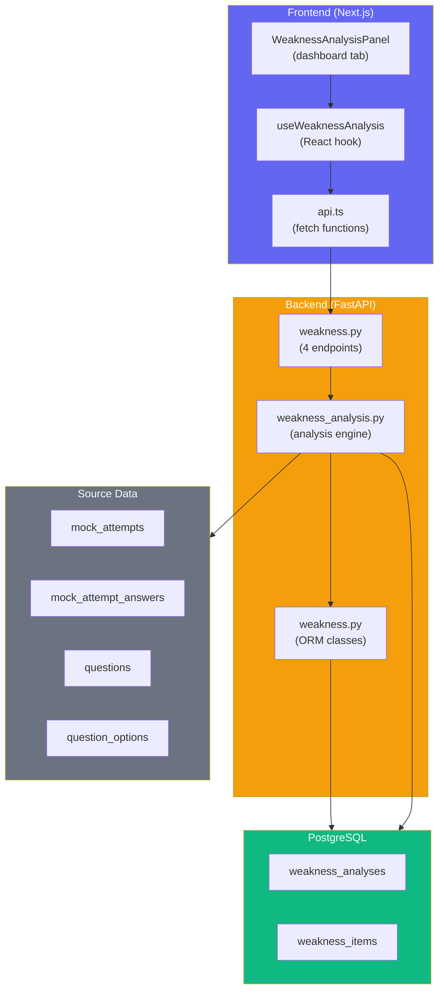

### Request Flow

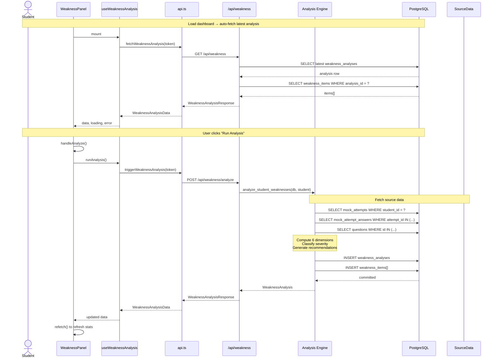

---

## Data Model

### Tables Created (Migration 005)

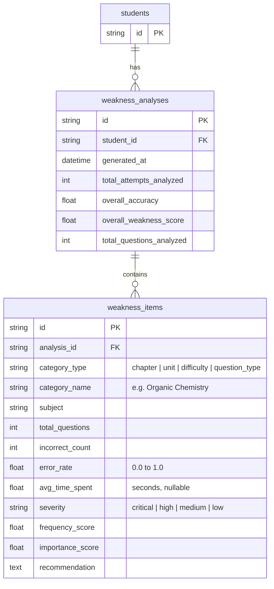

### Source Data Used (Pre-existing)

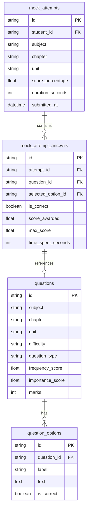

---

## API Reference

### `POST /api/weakness/analyze`

Trigger a fresh analysis. Computes all dimensions and persists results.

**Auth:** Clerk JWT (Bearer token)  
**Response `200`:**
```json
{
  "id": "uuid-string",
  "generated_at": "2026-06-14T12:00:00",
  "total_attempts_analyzed": 5,
  "overall_accuracy": 0.72,
  "overall_weakness_score": 0.28,
  "total_questions_analyzed": 50,
  "items": [
    {
      "category_type": "chapter",
      "category_name": "Organic Chemistry",
      "subject": "chemistry",
      "total_questions": 10,
      "incorrect_count": 7,
      "error_rate": 0.7,
      "avg_time_spent": 85.3,
      "severity": "high",
      "frequency_score": 0.85,
      "importance_score": 0.9,
      "recommendation": "Focus on revising Organic Chemistry fundamentals..."
    }
  ]
}
```

### `GET /api/weakness`

Get the most recent analysis for the current student.

**Auth:** Clerk JWT (Bearer token)  
**Response `200`:** Same shape as POST /analyze  
**Response (no data):** Returns empty analysis with `id: ""`, all zeros, empty items.

### `GET /api/weakness/items`

Get weakness items from the latest analysis, with optional filters.

**Query Parameters:**
| Param | Type | Description |
|-------|------|-------------|
| `severity` | string | Filter: `critical`, `high`, `medium`, `low` |
| `category_type` | string | Filter: `chapter`, `unit`, `difficulty`, `question_type` |

**Auth:** Clerk JWT (Bearer token)  
**Response `200`:** Array of `WeaknessItemResponse`

### `GET /api/weakness/trends`

Get per-attempt score trends over time (for sparkline charts).

**Query Parameters:**
| Param | Type | Default | Description |
|-------|------|---------|-------------|
| `subject` | string | — | Filter by subject |
| `limit` | int | 20 | Max attempts to return (1–100) |

**Auth:** Clerk JWT (Bearer token)  
**Response `200`:**
```json
{
  "trends": [
    {
      "attempt_id": "uuid",
      "subject": "physics",
      "chapter": "Electrostatics",
      "score_percentage": 65.0,
      "correct_count": 7,
      "total_questions": 10,
      "submitted_at": "2026-06-10T14:30:00"
    }
  ]
}
```

---

## Analysis Dimensions

The engine computes six dimensions of weakness:

| # | Dimension | Source Field | Question Answered |
|---|-----------|-------------|-------------------|
| 1 | **Chapter-level** | `questions.chapter` | "Which chapters have the highest error rates?" |
| 2 | **Unit-level** | `questions.unit` | "Which specific units within chapters are weak?" |
| 3 | **Difficulty-level** | `questions.difficulty` | "Is the student struggling with Easy, Medium, or Hard questions?" |
| 4 | **Question-type** | `questions.question_type` | "Are they better at MCQs vs theory questions?" |
| 5 | **Distractor analysis** | `question_options.label` | "Which wrong options are most commonly picked?" (data collected, v1 shows in expandable panel) |
| 6 | **Time efficiency** | `time_spent_seconds` | "Are they spending too long on certain question types?" |

### Computation Logic (per dimension)

```
For each (student, dimension):
  1. Group answer_data by dimension value (e.g., chapter = "Organic Chemistry")
  2. For each group:
     - total = count of answers
     - incorrect = count where is_correct = False
     - error_rate = incorrect / (incorrect + correct)
     - avg_time = AVG(time_spent_seconds) WHERE time_spent_seconds IS NOT NULL
     - severity = classify(error_rate)
     - recommendation = generate(category, error_rate)
```

---

## Severity Classification

| Severity | Error Rate Threshold | Color | Meaning |
|----------|--------------------|-------|---------|
| **critical** | ≥ 0.80 (80%) | Red | Foundational concepts missing |
| **high** | ≥ 0.60 (60%) | Orange | Significant gaps need attention |
| **medium** | ≥ 0.40 (40%) | Yellow | Moderate weakness, should review |
| **low** | < 0.40 (40%) | Green | Generally strong, maintain practice |

### Recommendation Templates

| Severity | Template |
|----------|----------|
| **critical** | "Critical weakness in [name]. Revise foundational concepts and practice targeted questions daily." |
| **high** | "Focus on revising [name] fundamentals. Practice more questions to improve understanding." |
| **medium** | "Review [name] concepts and practice targeted exercises to strengthen this area." |
| **low** | "Keep up the good work in [name]. Regular revision will maintain your strength." |

---

## Frontend Panel

### States

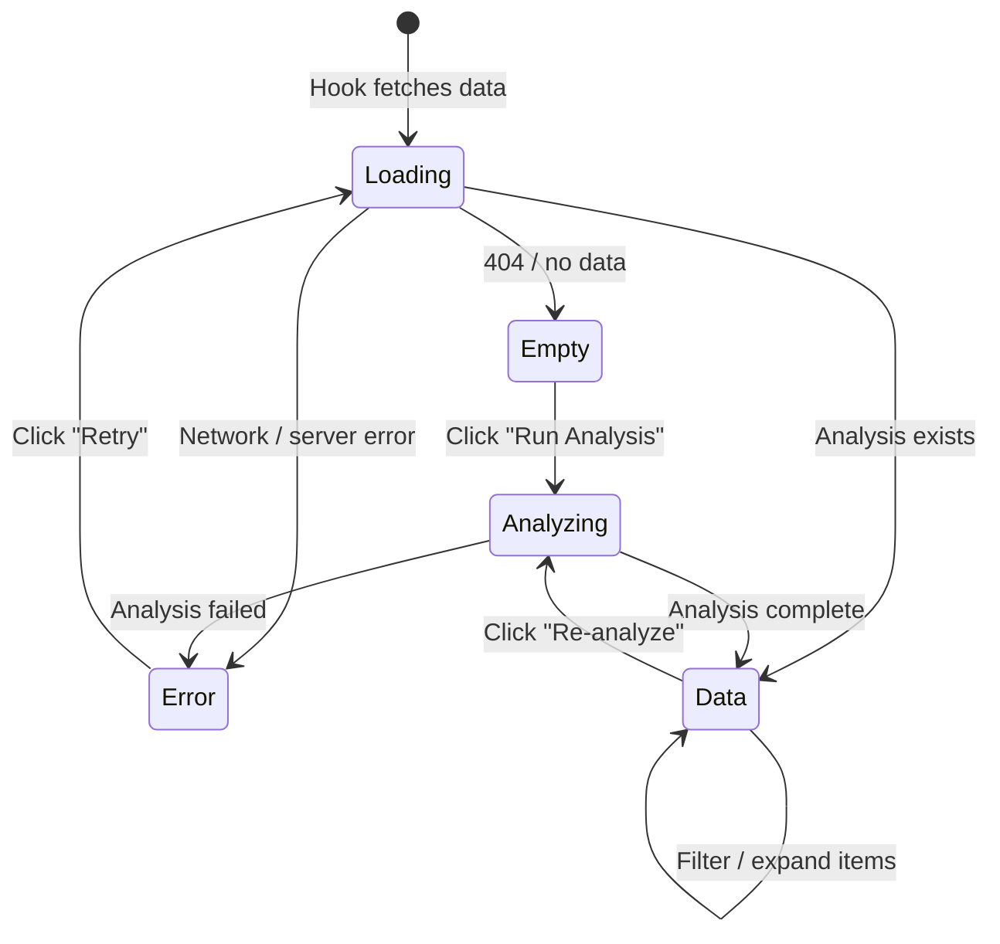

### Panel Layout

```
┌─────────────────────────────────────────────────┐
│  Last analysis: 6/14/2026, 2:30 PM  [Re-analyze]│
├─────────────────────────────────────────────────┤
│ ┌──────────┐ ┌──────────┐ ┌──────────┐ ┌──────┐│
│ │Weak Score│ │ Accuracy │ │Attempts  │ │Q's   ││
│ │    28    │ │   72%    │ │    5     │ │  50  ││
│ │Mod gaps  │ │All mock  │ │Recent    │ │Total ││
│ └──────────┘ └──────────┘ └──────────┘ └──────┘│
├─────────────────────────────────────────────────┤
│  Accuracy ████████████████░░░░░░░░░  72%         │
├─────────────────────────────────────────────────┤
│ ⚠ Priority Weaknesses (3)                        │
│ ┌─────────────────────────────────────────────┐ │
│ │ Organic Chemistry         🔴 high  7/10 wrong│ │
│ │ Electrostatics           🟠 high  6/8 wrong │ │
│ │ Hard questions           🟡 medium 5/9 wrong│ │
│ └─────────────────────────────────────────────┘ │
├─────────────────────────────────────────────────┤
│ All Weakness Areas (8)                          │
│ ┌─────────────────────────────────────────────┐ │
│ │ ▶ Organic Chemistry       🔴 0.70  7/10   │ │
│ │ ▶ Electrostatics          🟠 0.60  6/8    │ │
│ │ ▶ Hard questions          🟡 0.56  5/9    │ │
│ │ ▶ MCQ                     🟢 0.30  3/10   │ │
│ └─────────────────────────────────────────────┘ │
└─────────────────────────────────────────────────┘
```

### Component Tree

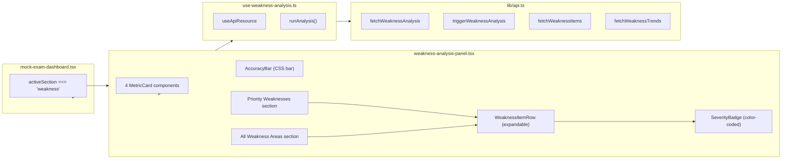

---

## Interaction With Other Modules

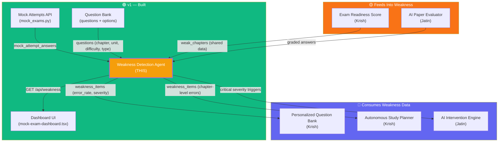

### How Each Module Interacts

| Module | Relationship | What Data Flows |
|--------|-------------|-----------------|
| **Mock Attempts API** | **Data source** | All `mock_attempt_answers` with `is_correct`, `time_spent_seconds`, `selected_option_id` |
| **Question Bank** | **Data source** | `questions.chapter`, `questions.unit`, `questions.difficulty`, `questions.question_type`, `questions.frequency_score`, `questions.importance_score` |
| **Dashboard UI** | **Consumer** | Weakness panel displayed as dashboard tab; "Weak Concepts" metric card uses `weaknessData.items` count |
| **Personalized Question Bank** (Krish) | **Consumer** (blocked until weakness ships) | `weakness_items` with `category_type="chapter"` and high severity → filter/rank questions targeting those chapters |
| **Autonomous Study Planner** (Krish) | **Consumer** (blocked until weakness ships) | Weakness items grouped by chapter → build study plan topics prioritized by error_rate × importance_score |
| **AI Intervention Engine** (Jatin) | **Consumer** | Items with `severity="critical"` → trigger mentor alert + workload reduction suggestions |
| **Exam Readiness Score** | **Peer dependency** | Currently uses `weak_chapters` array (hardcoded). Could consume `weakness_items` instead for live data. |
| **AI Paper Evaluator** | **Future data source** | Graded theory answers from uploaded PDFs → feed `is_correct` and `max_score` into the same analysis pipeline |

### Dependency Graph for Downstream Features

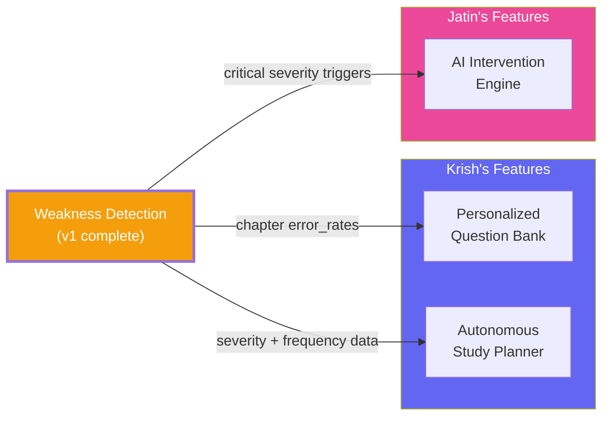

---

## V2 Roadmap

### V2 — LLM-Powered, Auto-Triggered, Comparative

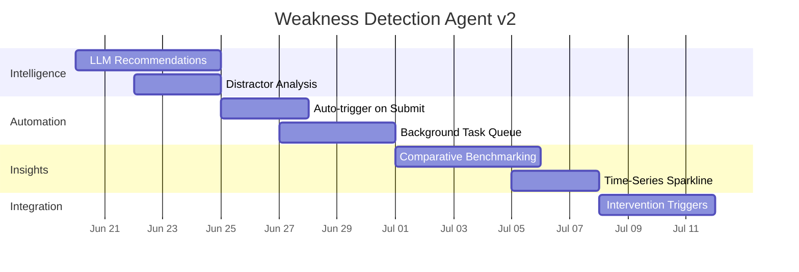

### V2 Feature Breakdown

#### 1. LLM-Powered Recommendations (Gemini)

**v1:** Template-based recommendations ("Focus on revising X fundamentals.")
**v2:** Gemini generates context-aware study tips using the student's actual wrong answers.

```python
# v2 approach
def _llm_recommendation(category_name, error_rate, wrong_answers, question_texts):
    prompt = f"""
    Student error rate: {error_rate:.0%} in {category_name}
    
    Questions they got wrong:
    {format_questions(question_texts)}
    
    Wrong answers they selected:
    {format_wrong_answers(wrong_answers)}
    
    Generate 3 specific, actionable study tips for this student.
    Focus on what they should revise, not generic advice.
    """
    return gemini.generate(prompt)
```

#### 2. Distractor Analysis

**v1:** Selected option IDs are collected but not analyzed.
**v2:** Add a new `category_type="distractor"` that groups wrong answers by the incorrect option chosen, identifying common misconceptions.

| Current Pattern | What It Reveals |
|----------------|-----------------|
| "Option B (boiling point) picked 60% of wrong answers in Organic Chemistry" | Student confuses boiling vs melting point |
| "Option D (mitosis phase) picked 45% of wrong answers in Cell Biology" | Student has a specific knowledge gap |

#### 3. Auto-Trigger on Attempt Submission

**v1:** User must manually click "Run Analysis" button.
**v2:** Add a hook in the mock attempt submission route:

```python
# In mock_exams.py create_attempt(), after db.commit():
background_tasks.add_task(
    analyze_student_weaknesses, db_session, student
)
```

The frontend panel auto-updates via the existing `refetch()` on successful submission.

#### 4. Background Task Queue

**v1:** Analysis runs synchronously (could block the request for 5+ seconds with 100+ attempts).
**v2:** Use `arq` (lightweight Redis queue) or `background_tasks` from FastAPI:

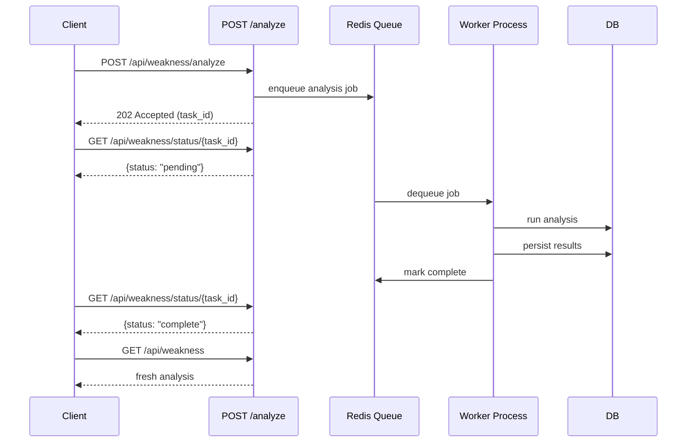

#### 5. Comparative Benchmarking

Add a `weakness_benchmarks` table that stores aggregate stats:

```sql
CREATE TABLE weakness_benchmarks (
    id VARCHAR(36) PRIMARY KEY,
    subject VARCHAR NOT NULL,
    chapter VARCHAR NOT NULL,
    difficulty VARCHAR NOT NULL,
    avg_error_rate FLOAT NOT NULL DEFAULT 0,
    student_count INTEGER NOT NULL DEFAULT 0,
    computed_at TIMESTAMP NOT NULL DEFAULT CURRENT_TIMESTAMP
);
```

Then show percentiles: **"You're in the bottom 20% for Organic Chemistry compared to other CBSE 12th Science students."**

#### 6. Time-Series Sparkline (Frontend)

**v1:** Trends endpoint returns data, panel shows numbers.
**v2:** Add an SVG sparkline chart in the weakness panel header, showing accuracy over time:

```tsx
function AccuracySparkline({ trends }: { trends: WeaknessTrendPoint[] }) {
  // render inline SVG polyline
  // color: green if improving, red if declining
}
```

#### 7. Intervention Triggers

After each analysis completes, check for thresholds:

| Condition | Action |
|-----------|--------|
| Any item with severity "critical" | Push notification + email to student |
| 3+ items with severity "critical" | Alert mentor / parent dashboard |
| Weakness score increased >20% since last analysis | Flag for AI Intervention Engine |
| No analysis run >7 days despite new attempts | Reminder notification |

#### 8. V2 Database Changes

```sql
-- Migration 006: Weakness Analysis v2
ALTER TABLE weakness_items ADD COLUMN IF NOT EXISTS llm_recommendation TEXT;
ALTER TABLE weakness_items ADD COLUMN IF NOT EXISTS distractor_option_label VARCHAR;
ALTER TABLE weakness_items ADD COLUMN IF NOT EXISTS percentile_rank FLOAT;

CREATE TABLE IF NOT EXISTS weakness_benchmarks (
    id VARCHAR(36) PRIMARY KEY,
    subject VARCHAR NOT NULL,
    chapter VARCHAR NOT NULL,
    difficulty VARCHAR NOT NULL,
    avg_error_rate FLOAT NOT NULL DEFAULT 0,
    student_count INTEGER NOT NULL DEFAULT 0,
    computed_at TIMESTAMP NOT NULL DEFAULT CURRENT_TIMESTAMP
);
```

### V2 Architecture

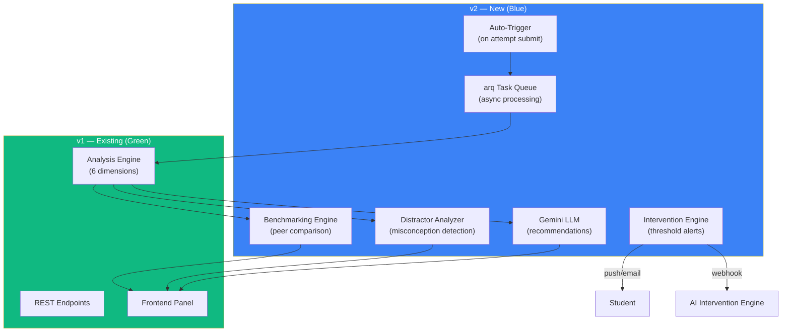

---

## Edge Cases Handled

| Edge Case | How It's Handled |
|-----------|------------------|
| **Zero attempts** | Returns empty analysis (id="", all zeros, empty items array) |
| **Partial `is_correct` data** | Only scorable entries (is_correct is True or False, not null) are counted in error rate; unscored entries still contribute to total_questions |
| **Missing `time_spent_seconds`** | avg_time_spent is null for items where no entries have time data; computation gracefully skips null values |
| **Deleted/inactive questions** | LEFT JOIN from answers to questions; if question is missing, the answer is excluded from analysis but attempt count is unaffected |
| **Multiple rapid analyses** | Each call creates a new `weakness_analyses` row; no deduplication in v1 (safe since reads always fetch latest) |
| **No `selected_option_id`** | Distractor analysis gracefully skips answers without option selection (theory questions) |
| **Student with no attempts ever** | Empty analysis returned; "Run Analysis" button still works but produces empty result |
| **Concurrent analysis requests** | Both succeed independently, creating two rows; GET always returns the latest by `generated_at DESC` |
| **Clerk JWT expires mid-request** | `get_current_user` dependency raises 401; the route never executes, DB remains untouched |

---

## Files Reference

### Backend

| File | Purpose |
|------|---------|
| `backend/migrations/005_add_weakness_analysis.sql` | Creates `weakness_analyses` and `weakness_items` tables |
| `backend/app/models/weakness.py` | SQLAlchemy ORM: `WeaknessAnalysis`, `WeaknessItem` |
| `backend/app/models/__init__.py` | Exports new models |
| `backend/app/models/student.py` | Added `weakness_analyses` relationship |
| `backend/app/schemas/weakness.py` | Pydantic: `WeaknessAnalysisResponse`, `WeaknessItemResponse`, `WeaknessTrendPoint`, `WeaknessTrendResponse` |
| `backend/app/services/weakness_analysis.py` | Core engine: `analyze_student_weaknesses()`, `_collect_answer_data()`, `_compute_dimension_analysis()`, `_classify_severity()`, `_generate_recommendation()` |
| `backend/app/routes/weakness.py` | 4 endpoints: `POST /analyze`, `GET /`, `GET /items`, `GET /trends` |
| `backend/app/main.py` | Registered `weakness_router` |

### Frontend

| File | Purpose |
|------|---------|
| `frontend/lib/api.ts` | Types: `WeaknessItemData`, `WeaknessAnalysisData`, `WeaknessTrendPoint`, `WeaknessTrendResponse`; Functions: `fetchWeaknessAnalysis`, `triggerWeaknessAnalysis`, `fetchWeaknessItems`, `fetchWeaknessTrends` |
| `frontend/hooks/use-weakness-analysis.ts` | React hook wrapping `useApiResource` with `runAnalysis()` trigger |
| `frontend/components/dashboard/weakness-analysis-panel.tsx` | Panel component: 4 states, metric cards, accuracy bar, expandable weakness items, severity badge |
| `frontend/components/dashboard/mock-exam-dashboard.tsx` | Added weakness tab, hook call, dashboardStats integration |

---

## Verification

| Check | Status |
|-------|--------|
| `python -m compileall app` | ✅ All 34 backend files compile |
| `npm run lint` (tsc --noEmit) | ✅ Zero TypeScript errors |
| `npm run build` (Next.js production) | ✅ Build succeeds |
| Frontend type coverage | ✅ All API responses typed |
