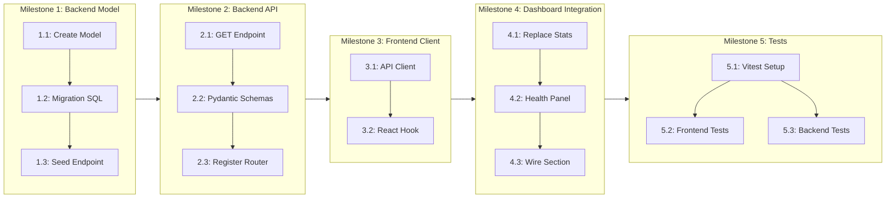

# Implementation Guide — Feature 1: Academic Health Monitoring Agent

> **Feature Owner:** Krish  
> **Priority:** Phase 1 (No blockers, start now)  
> **Status:** 🟢 Ready for implementation  
> **Estimated Milestones:** 5 subtasks  

---

## 1. Feature Definition

### What It Is

The Academic Health Monitoring Agent is an autonomous system that continuously computes a student's "Academic Health Index" — a composite score derived from mock test performance, study consistency, revision rhythm, and engagement patterns. It surfaces this as a live dashboard widget and provides trend data over time.

### Goal

Create a backend API + frontend widget that displays:
- **Academic Health Score** (0-100) — composite of multiple metrics
- **Score Trend** — up/down/stable over last 7 days
- **Study Time** — hours studied this week
- **Revision Frequency** — how often student revisits past weak topics  
- **Engagement Streak** — consecutive days of activity

### MVP Scope (What We Build Now)

Since there's no mock attempt data or study logging yet, Phase 1 builds:
1. The **database table** to store computed health data
2. A **backend API** that returns health data for a student
3. A **seed data endpoint** (for demo without real data)
4. A **frontend widget** in the dashboard that shows live health data
5. **Dashboard integration** — replace the hardcoded dashboardStats with real API data

### Future Scope (Not in MVP)

- Real computation from mock attempts
- Study time tracking integration
- AI-driven trend analysis and predictions
- Historical charting

---

## 2. Codebase Patterns Reference

### 2.1 Frontend Dashboard Architecture

The dashboard lives in `frontend/components/dashboard/mock-exam-dashboard.tsx` (~2243 lines, monolithic). Key patterns:

**Dashboard sections** are defined as a typed config array:
```typescript
type DashboardSection = "academic-health" | "weakness" | "study-plan" | ...;
type FeatureStatus = "Active" | "Next" | "Planned";

const dashboardSections: { id, label, shortLabel, description, owner, status, stage, icon, accent, signals, nextMilestone }[] = [...];
```

**Dashboard stats** (currently hardcoded at line 445):
```typescript
const dashboardStats = [
  { label: "Academic Health", value: "82", detail: "Stable", icon: HeartPulseIcon },
  { label: "Exam Readiness", value: "74%", detail: "Physics focus", icon: GaugeIcon },
  { label: "Weak Concepts", value: "3", detail: "Needs revision", icon: BrainCircuitIcon },
  { label: "Today's Plan", value: "5", detail: "Tasks queued", icon: CalendarClockIcon },
];
```

**Section rendering** (line 687-1116):
- If `activeSection === "mock"` → renders full mock exam flow (setup/exam/results)
- If other sections → renders `SectionPlaceholder` component
- The `SectionPlaceholder` reads from `dashboardSections` config to show a placeholder with status, description, signals, and next milestone

**Page files** are thin wrappers:
```typescript
// app/dashboard/page.tsx
import { MockExamDashboard } from "@/components/dashboard/mock-exam-dashboard";
export default function DashboardPage() { return <MockExamDashboard />; }
```

### 2.2 Backend Architecture

**Route registration** (`backend/app/main.py`):
```python
from app.routes.auth import router as auth_router
app.include_router(auth_router)
```

**Route file** pattern:
```python
from fastapi import APIRouter
router = APIRouter(prefix="/api/health", tags=["health"])

@router.get("/{student_id}")
def get_health(student_id: str):
    ...
```

**Model** pattern (`backend/app/models/*.py`):
```python
from uuid import uuid4
from sqlalchemy import String, ForeignKey, Boolean
from sqlalchemy.orm import Mapped, mapped_column
from app.database import Base

class MyModel(Base):
    __tablename__ = "my_models"
    id: Mapped[str] = mapped_column(String(36), primary_key=True, default=lambda: str(uuid4()))
```

**Database** (`backend/app/database.py`):
```python
engine = create_engine(DATABASE_URL)
SessionLocal = sessionmaker(bind=engine, autoflush=False, autocommit=False)
Base = DeclarativeBase()
```

**Manual session management** (pattern from `webhooks.py`):
```python
db = SessionLocal()
try:
    # operations
    db.commit()
except Exception:
    db.rollback()
    raise
finally:
    db.close()
```

### 2.3 Existing Student Model

```python
class Student(Base):
    __tablename__ = "students"
    id: Mapped[str]          # PK
    user_id: Mapped[str]     # FK → users.id
    full_name: Mapped[str]
    is_individual: Mapped[bool]
    class_level: Mapped[str | None]   # "10th" | "12th"
    board: Mapped[str | None]          # "CBSE"
    stream: Mapped[str | None]         # "science" | "commerce"
    science_group: Mapped[str | None]  # "pcb" | "pcm" | "pcmb"
    onboarding_complete: Mapped[bool]
```

### 2.4 UI Components Style

```tsx
// Metric card pattern:
<Metric icon={HeartPulseIcon} label="Academic Health" value="82" detail="Stable" />

// Button pattern:
<Button className="gap-2" onClick={handler}>
  <SomeIcon className="h-4 w-4" />
  Label
</Button>

// Section card pattern:
<section className="rounded-lg border bg-card p-5 shadow-sm shadow-black/5">
  <div className="flex items-start gap-3">...</div>
</section>

// Stat display pattern:
<ResultStat label="Score" value="85%" />
```

---

## 3. Assumptions & Clarifications

| # | Assumption | Status | Resolution |
|---|-----------|--------|------------|
| 1 | Health score formula starts simple: weighted avg of (mock_accuracy × 0.5 + consistency × 0.3 + revision × 0.2) | ✅ Confirmed — MVP can use static weights, computed server-side | No real attempt data yet → seed endpoint returns demo data |
| 2 | "Academic Health" dashboard stat currently shows "82" (hardcoded). We replace only the stat card, not the whole section. | ✅ Confirmed — the stat card at top + full section workspace when clicked | The `dashboardStats` array has `{ label: "Academic Health", value: "82", detail: "Stable" }` |
| 3 | No `routes/__init__.py` or `schemas/__init__.py` exists — we create them | ✅ Confirmed — directory __init__ files need to be created | Good practice for package organization |
| 4 | The Academic Health section in `dashboardSections` already exists with id `"academic-health"` | ✅ Confirmed — config at line 327-338 of mock-exam-dashboard.tsx | Section exists but renders `SectionPlaceholder` — we replace with real component |
| 5 | No vitest config exists yet | ⚠️ **New setup needed** | We install and configure vitest as part of subtask 5 |
| 6 | Backend serves health data via REST API; frontend fetches it on section mount | ✅ Confirmed — this aligns with the planned architecture | MVP: `GET /api/health/{student_id}` returns health data. Seed endpoint for demo. |
| 7 | Authentication for API endpoints | ❌ **No backend auth exists yet** | MVP: no auth on health endpoint (same as current webhooks + stubs). Add a TODO note. Future: Clerk JWT middleware |
| 8 | Student ID mapping: Frontend knows Clerk user ID, backend uses internal UUID | Needs consideration | Webhook returns internal `user.id` (UUID). Frontend needs either: (a) store user ID after webhook, or (b) look up by clerk_user_id. **Decision:** Use `clerk_user_id` as the lookup key on the health endpoint for now. Backend joins `User.clerk_user_id → User.id → Student.id` |

---

## 4. Implementation Plan

### Overview

```
                  ┌──────────────────────┐
                  │  Academic Health API  │
                  │  backend/             │
                  └──────────┬───────────┘
                             │ GET /api/health/{clerk_user_id}
                             ▼
                  ┌──────────────────────┐
                  │  Frontend Dashboard   │
                  │  Integration           │
                  └──────────┬───────────┘
                             │ Replace hardcoded stats
                             ▼
                  ┌──────────────────────┐
                  │  AcademicHealthPanel  │
                  │  Component             │
                  └──────────────────────┘
```

### Milestone Breakdown

```
Milestone 1: Backend — Data Model + Seed
  └── Subtask 1.1: Create AcademicHealth SQLAlchemy model
  └── Subtask 1.2: Create migration SQL
  └── Subtask 1.3: Create seed data endpoint

Milestone 2: Backend — Health API
  └── Subtask 2.1: Create GET /api/health/{clerk_user_id} route
  └── Subtask 2.2: Create Pydantic schemas
  └── Subtask 2.3: Register router in main.py

Milestone 3: Frontend — API Client
  └── Subtask 3.1: Create lib/api.ts fetch utility
  └── Subtask 3.2: Create useAcademicHealth hook

Milestone 4: Frontend — Dashboard Integration
  └── Subtask 4.1: Replace hardcoded dashboardStats with API data
  └── Subtask 4.2: Build AcademicHealthPanel component
  └── Subtask 4.3: Wire section routing to show health panel

Milestone 5: Tests
  └── Subtask 5.1: Set up vitest + testing library
  └── Subtask 5.2: Frontend tests for AcademicHealthPanel
  └── Subtask 5.3: Backend tests for health API
```

---

## 5. Files to Create / Modify

### 5.1 New Files

| # | File | Purpose |
|---|------|---------|
| 1 | `backend/app/models/academic_health.py` | SQLAlchemy model for health data |
| 2 | `backend/app/schemas/__init__.py` | Package init for schemas |
| 3 | `backend/app/schemas/health.py` | Pydantic request/response schemas |
| 4 | `backend/app/routes/health.py` | Health API endpoints |
| 5 | `backend/migrations/002_add_academic_health_table.sql` | DB migration |
| 6 | `frontend/lib/api.ts` | API fetch client utility |
| 7 | `frontend/hooks/use-academic-health.ts` | Hook for fetching health data |
| 8 | `frontend/components/dashboard/academic-health-panel.tsx` | Health panel widget |
| 9 | `frontend/__tests__/setup.ts` | Vitest setup file |
| 10 | `frontend/__tests__/components/academic-health-panel.test.tsx` | Frontend test |
| 11 | `backend/app/tests/test_health.py` | Backend test |

### 5.2 Files to Modify

| # | File | Change |
|---|------|--------|
| 1 | `backend/app/main.py` | Add `router = health_router`, `app.include_router()` |
| 2 | `backend/app/database.py` | No changes needed (Base re-exports) |
| 3 | `frontend/components/dashboard/mock-exam-dashboard.tsx` | Import health data hook, replace hardcoded stats, wire section rendering |
| 4 | `frontend/package.json` | Add `vitest`, `@testing-library/react`, `@testing-library/jest-dom` |
| 5 | `frontend/vitest.config.ts` | **New file** — vitest configuration |

---

## 6. Design Specifications

### 6.1 Database Schema

#### `academic_health` Table

```sql
CREATE TABLE academic_health (
    id VARCHAR(36) PRIMARY KEY,
    student_id VARCHAR(36) NOT NULL REFERENCES students(id),
    health_score DECIMAL(5,2) NOT NULL DEFAULT 0.00,  -- 0.00 to 100.00
    trend VARCHAR(10) NOT NULL DEFAULT 'stable',       -- 'up', 'down', 'stable'
    study_hours_week DECIMAL(5,2) DEFAULT 0.00,       -- hours studied this week
    revision_frequency INT DEFAULT 0,                   -- topics revised this week
    engagement_streak INT DEFAULT 0,                    -- consecutive active days
    mock_accuracy DECIMAL(5,2) DEFAULT 0.00,           -- average mock accuracy
    last_updated TIMESTAMP DEFAULT NOW(),
    created_at TIMESTAMP DEFAULT NOW()
);
```

**Design Notes:**
- `health_score` is the composite metric displayed in the dashboard
- `trend` is computed by comparing current vs. previous period
- `mock_accuracy` is a placeholder — will be computed from real attempt data in future
- Last 7 days of data are kept; older data can be sampled for trend computation
- `DECIMAL(5,2)` allows values like `83.50`

### 6.2 API Contract

#### `GET /api/health/{clerk_user_id}`

**Response 200:**
```json
{
  "student_id": "uuid-here",
  "clerk_user_id": "clerk_user_123",
  "health_score": 82.5,
  "trend": "up",
  "study_hours_week": 12.5,
  "revision_frequency": 8,
  "engagement_streak": 5,
  "mock_accuracy": 74.0,
  "last_updated": "2026-06-13T10:30:00Z"
}
```

**Response 404:**
```json
{
  "detail": "Health data not found for student"
}
```

**Notes:**
- If no health record exists → 404 (caller creates via seed endpoint)
- Not authenticated (future: Clerk JWT)
- Uses `clerk_user_id` for lookup (joins User table) — frontend has this ID from Clerk session

#### `POST /api/health/seed/{clerk_user_id}`

**Purpose:** Create demo health data for testing without real attempt data.

**Request Body:**
```json
{
  "health_score": 82.5,
  "trend": "up",
  "study_hours_week": 12.5,
  "revision_frequency": 8,
  "engagement_streak": 5
}
```

**Response 201:**
```json
{
  "success": true,
  "message": "Health data seeded"
}
```

### 6.3 Frontend Component Spec

#### `AcademicHealthPanel` Component

```
┌──────────────────────────────────────────────────┐
│  🔵 Academic Health                  Active · Krish│
│                                                    │
│  ┌──────────┐  ┌──────────┐  ┌──────────┐  ┌────┐ │
│  │ 82.5     │  │ 12.5h    │  │ 8 topics  │  │ 5d  │ │
│  │ Health   │  │ Study    │  │ Revision  │  │Strk │ │
│  │ Score ▲  │  │ This Wk  │  │ This Wk   │  │    │ │
│  └──────────┘  └──────────┘  └──────────┘  └────┘ │
│                                                    │
│  ┌─ Score Trend ──────────────────────────────────┐ │
│  │  ████████████████▓▓▓▓▓▓▓███  82.5 ▲ Up        │ │
│  │  Mon Tue Wed Thu Fri Sat Sun                   │ │
│  └────────────────────────────────────────────────┘ │
│                                                    │
│  Last updated: 10:30 AM today                       │
└──────────────────────────────────────────────────────┘
```

**States:**
- **Loading:** Gray skeleton cards with pulse animation
- **Loaded:** Real data displayed in metric cards + trend bar
- **Error:** Error state with retry button
- **Empty/No data:** "No health data yet. Complete a mock exam to generate your health score." + seed CTA

### 6.4 API Client

```typescript
// frontend/lib/api.ts
const API_BASE = process.env.NEXT_PUBLIC_API_URL || "http://127.0.0.1:8000";

export async function fetchHealthData(clerkUserId: string) {
  const res = await fetch(`${API_BASE}/api/health/${encodeURIComponent(clerkUserId)}`);
  if (!res.ok) throw new Error("Failed to fetch health data");
  return res.json() as Promise<HealthData>;
}

export async function seedHealthData(clerkUserId: string, data: SeedHealthData) {
  const res = await fetch(`${API_BASE}/api/health/seed/${encodeURIComponent(clerkUserId)}`, {
    method: "POST",
    headers: { "Content-Type": "application/json" },
    body: JSON.stringify(data),
  });
  if (!res.ok) throw new Error("Failed to seed health data");
  return res.json();
}
```

### 6.5 Hook

```typescript
// frontend/hooks/use-academic-health.ts
export function useAcademicHealth(clerkUserId: string | null | undefined) {
  const [data, setData] = useState<HealthData | null>(null);
  const [loading, setLoading] = useState(false);
  const [error, setError] = useState<string | null>(null);

  useEffect(() => {
    if (!clerkUserId) return;
    setLoading(true);
    fetchHealthData(clerkUserId)
      .then(setData)
      .catch((err) => setError(err.message))
      .finally(() => setLoading(false));
  }, [clerkUserId]);

  return { data, loading, error, refetch: ... };
}
```

### 6.6 Dashboard Integration

**In `mock-exam-dashboard.tsx`:**

1. **Import** the hook and useAuth from Clerk:
   ```typescript
   import { useUser } from "@clerk/nextjs";
   import { useAcademicHealth } from "@/hooks/use-academic-health";
   ```

2. **Inside MockExamDashboard(), add:**
   ```typescript
   const { user } = useUser();
   const { data: healthData, loading: healthLoading, error: healthError } = 
     useAcademicHealth(user?.id);
   ```

3. **Replace the hardcoded `dashboardStats`:**
   Remove the static `dashboardStats` array. Instead, compute:
   ```typescript
   const computedStats = [
     { label: "Academic Health", value: healthData?.health_score?.toString() ?? "—", detail: healthData?.trend ?? "No data", icon: HeartPulseIcon },
     { label: "Exam Readiness", value: "74%", detail: "Physics focus", icon: GaugeIcon },
     // ... others remain hardcoded for now
   ];
   ```

4. **Wire the "academic-health" section** to render `AcademicHealthPanel` instead of `SectionPlaceholder`:
   ```typescript
   {activeSection === "academic-health" ? (
     <AcademicHealthPanel healthData={healthData} loading={healthLoading} error={healthError} clerkUserId={user?.id} />
   ) : activeSection === "mock" ? (
     // existing mock flow...
   ) : (
     <SectionPlaceholder ... />
   )}
   ```

---

## 7. Subtask Breakdown with AI Prompts

---

### Subtask 1.1: Create AcademicHealth SQLAlchemy Model

**Goal:** Create the `AcademicHealth` model in `backend/app/models/academic_health.py`

**Context:** We follow the existing patterns from `models/student.py` and `models/user.py`. The model extends `Base` from `app.database`, uses UUID4 string PKs, SQLAlchemy 2.0 `Mapped` annotation style, and the `students` FK relationship.

**AI Prompt:**
```
TASK: Create a new SQLAlchemy model `AcademicHealth` in backend/app/models/academic_health.py

EXPECTED OUTCOME: 
A Python file with the AcademicHealth model class matching the existing codebase patterns.

REQUIRED TOOLS: Read, Write

MUST DO:
- Create file: backend/app/models/academic_health.py
- Import from uuid import uuid4
- Import from sqlalchemy: String, ForeignKey, Boolean, Float, DateTime, Text
- Import from sqlalchemy.orm: Mapped, mapped_column, relationship
- Import from app.database: Base
- Class name: AcademicHealth
- Table name: "academic_health"
- Columns:
  - id: Mapped[str] = mapped_column(String(36), primary_key=True, default=lambda: str(uuid4()))
  - student_id: Mapped[str] = mapped_column(ForeignKey("students.id"), nullable=False, unique=True, index=True)
  - health_score: Mapped[float] = mapped_column(Float, default=0.0, nullable=False)
  - trend: Mapped[str] = mapped_column(String(10), default="stable", nullable=False)  # "up", "down", "stable"
  - study_hours_week: Mapped[float] = mapped_column(Float, default=0.0)
  - revision_frequency: Mapped[int] = mapped_column(default=0)
  - engagement_streak: Mapped[int] = mapped_column(default=0)
  - mock_accuracy: Mapped[float] = mapped_column(Float, default=0.0)
  - last_updated: use DateTime with server_default=func.now() and onupdate=func.now()
    Actually, since SQLAlchemy doesn't have onupdate at the column level in DeclarativeBase style,
    use: default=lambda: datetime.utcnow() and nullable=True initially
  - created_at: use default=lambda: datetime.utcnow()
- Add: student = relationship("Student", back_populates="academic_health") — creates a one-to-one
- Also add to Student model: academic_health = relationship("AcademicHealth", back_populates="student", uselist=False)
  - EDIT student.py to add this relationship

MUST NOT DO:
- Do not change any existing behavior
- Do not add other relationships
- Do not import unused modules

CONTEXT:
- Base class is defined in backend/app/database.py as DeclarativeBase
- Student model is at backend/app/models/student.py with __tablename__ = "students"
- All models follow the pattern: from uuid import uuid4; from sqlalchemy.orm import Mapped, mapped_column, relationship; from app.database import Base
- Example from student.py:
  ```python
  from uuid import uuid4
  from sqlalchemy import String, ForeignKey, Boolean
  from sqlalchemy.orm import Mapped, mapped_column, relationship
  from app.database import Base

  class Student(Base):
      __tablename__ = "students"
      id: Mapped[str] = mapped_column(String(36), primary_key=True, default=lambda: str(uuid4()))
      ...
  ```
```

---

### Subtask 1.2: Register Model Exports + Create Migration

**Goal:** Export `AcademicHealth` from models `__init__.py` and create the DB migration SQL

**Context:** The `models/__init__.py` exports all models. We need to add AcademicHealth. The migration follows the pattern from `backend/migrations/001_add_student_onboarding_fields.sql`.

**AI Prompt:**
```
TASK: Register AcademicHealth in models __init__.py and create migration SQL

EXPECTED OUTCOME:
1. backend/app/models/__init__.py updated to import AcademicHealth
2. backend/migrations/002_add_academic_health_table.sql created

REQUIRED TOOLS: Read, Write, Edit

MUST DO:
- EDIT backend/app/models/__init__.py:
  - Add import: from app.models.academic_health import AcademicHealth
  - Add "AcademicHealth" to __all__ list
- CREATE backend/migrations/002_add_academic_health_table.sql:
  - Use CREATE TABLE IF NOT EXISTS
  - All columns from the model definition
  - Use VARCHAR(36) for UUID fields
  - Use DECIMAL(5,2) for Float fields
  - Use INTEGER for int fields
  - Use TIMESTAMP for DateTime fields
  - Add foreign key: FOREIGN KEY (student_id) REFERENCES students(id)
  - Add UNIQUE constraint on student_id since it's one-to-one

MUST NOT DO:
- Do not drop or alter existing tables
- Do not include DROP statements

CONTEXT:
- Migration pattern from backend/migrations/001_add_student_onboarding_fields.sql:
  ```sql
  ALTER TABLE students
  ADD COLUMN IF NOT EXISTS class_level VARCHAR,
  ADD COLUMN IF NOT EXISTS board VARCHAR,
  ...
  ```
- For this migration we use CREATE TABLE since it's a new table:
  ```sql
  CREATE TABLE IF NOT EXISTS academic_health (
      id VARCHAR(36) PRIMARY KEY,
      student_id VARCHAR(36) NOT NULL UNIQUE,
      health_score DECIMAL(5,2) NOT NULL DEFAULT 0.00,
      trend VARCHAR(10) NOT NULL DEFAULT 'stable',
      study_hours_week DECIMAL(5,2) DEFAULT 0.00,
      revision_frequency INTEGER DEFAULT 0,
      engagement_streak INTEGER DEFAULT 0,
      mock_accuracy DECIMAL(5,2) DEFAULT 0.00,
      last_updated TIMESTAMP DEFAULT NOW(),
      created_at TIMESTAMP DEFAULT NOW(),
      FOREIGN KEY (student_id) REFERENCES students(id)
  );
  ```
```

---

### Subtask 1.3: Create Seed Data Endpoint

**Goal:** Create a POST endpoint that creates demo health data for a clerk_user_id

**Context:** The webhooks route shows the pattern for looking up users by clerk_user_id and creating related records. The seed endpoint will:
1. Look up the user by clerk_user_id
2. If user found, look up student
3. Create or update AcademicHealth record
4. Return success

**AI Prompt:**
```
TASK: Create seed data endpoint for Academic Health

EXPECTED OUTCOME: 
The file backend/app/routes/health.py exists with a POST /api/health/seed/{clerk_user_id} endpoint.

REQUIRED TOOLS: Read, Write

MUST DO:
- Create file: backend/app/routes/health.py
- Import: from fastapi import APIRouter, HTTPException
- Import: from app.database import SessionLocal
- Import: from app.models.user import User
- Import: from app.models.student import Student
- Import: from app.models.academic_health import AcademicHealth
- Import: from pydantic import BaseModel
- Create router: router = APIRouter(prefix="/api/health", tags=["health"])
- Create a Pydantic model for the seed request body:
  ```python
  class SeedHealthRequest(BaseModel):
      health_score: float = 82.5
      trend: str = "up"
      study_hours_week: float = 12.5
      revision_frequency: int = 8
      engagement_streak: int = 5
  ```
- Create POST endpoint:
  - Path: /seed/{clerk_user_id}
  - Function: seed_health_data(clerk_user_id: str, body: SeedHealthRequest)
  - Steps:
    1. Open DB session
    2. Query User by clerk_user_id
    3. If not found → raise 404
    4. Query Student by user_id
    5. If not found → raise 404
    6. Try to find existing AcademicHealth by student_id
    7. If exists → update fields
    8. If not exists → create new AcademicHealth record
    9. Commit, return {"success": True, "message": "Health data seeded"}
    10. Handle exceptions with rollback
    11. Close session in finally block
- Follow the exact session management pattern from webhooks.py:
  ```python
  db = SessionLocal()
  try:
      existing = db.query(...).filter(...).first()
      ...
      db.commit()
  except Exception as e:
      db.rollback()
      raise HTTPException(...)
  finally:
      db.close()
  ```

MUST NOT DO:
- Do not add authentication (not needed for MVP)
- Do not add unnecessary validation

CONTEXT:
- webhooks.py pattern for session management
- The router prefix is "/api/health", so the full path becomes POST /api/health/seed/{clerk_user_id}
- User has clerk_user_id field for lookup
- Student has user_id FK to User.id
- AcademicHealth has student_id FK to Student.id
```

---

### Subtask 2.1: Create GET Health Endpoint

**Goal:** Add a GET endpoint to fetch health data for a student by clerk_user_id

**Context:** Same file as subtask 1.3. We add a second endpoint. This endpoint joins User → Student → AcademicHealth to return the data.

**AI Prompt:**
```
TASK: Add GET /api/health/{clerk_user_id} endpoint

EXPECTED OUTCOME:
The file backend/app/routes/health.py now has a GET endpoint alongside the existing POST seed endpoint.

REQUIRED TOOLS: Read, Edit

MUST DO:
- EDIT backend/app/routes/health.py
- Add a GET endpoint:
  - Path: /{clerk_user_id}
  - Function: get_health(clerk_user_id: str)
  - Returns a dict with all AcademicHealth fields + student_id + clerk_user_id
  - Steps:
    1. Open DB session
    2. Query User by clerk_user_id
    3. If user not found → raise 404 "User not found"
    4. Query AcademicHealth joined with Student where Student.user_id == User.id
       - Use: db.query(AcademicHealth).join(Student, AcademicHealth.student_id == Student.id).filter(Student.user_id == user.id).first()
    5. If no health record → raise 404 "Health data not found. Seed some data first."
    6. Return dict with all fields + student_id + clerk_user_id
    7. Handle exceptions with rollback
    8. Close session in finally block
- Add this import if not present: from datetime import datetime
- Response shape:
  ```python
  return {
      "student_id": health.student_id,
      "clerk_user_id": clerk_user_id,
      "health_score": health.health_score,
      "trend": health.trend,
      "study_hours_week": health.study_hours_week,
      "revision_frequency": health.revision_frequency,
      "engagement_streak": health.engagement_streak,
      "mock_accuracy": health.mock_accuracy,
      "last_updated": health.last_updated.isoformat() if health.last_updated else None,
  }
  ```

MUST NOT DO:
- Do not change the existing seed endpoint
- Do not add authentication
- Do not expose internal implementation details in error messages

CONTEXT:
- The router already exists with prefix="/api/health"
- The GET endpoint path will be: GET /api/health/{clerk_user_id}
- Example call: GET /api/health/clerk_user_123
- Follow the same try/except/finally session pattern
```

---

### Subtask 2.2: Create Pydantic Schemas

**Goal:** Create proper Pydantic schemas for the health API

**Context:** The `schemas/` directory exists but is empty. `schemas/student.py` is an empty file. We create `schemas/__init__.py` + `schemas/health.py` with proper response models.

**AI Prompt:**
```
TASK: Create Pydantic schemas for the Academic Health API

EXPECTED OUTCOME:
1. backend/app/schemas/__init__.py created (empty init, or with re-exports)
2. backend/app/schemas/health.py created with Pydantic models

REQUIRED TOOLS: Write, Edit

MUST DO:
- CREATE backend/app/schemas/__init__.py (can be empty or have minimal content)
- CREATE backend/app/schemas/health.py:
  - Import: from pydantic import BaseModel
  - Import: from datetime import datetime
  - Import: from typing import Optional
  - Models:
    ```python
    class SeedHealthRequest(BaseModel):
        health_score: float = 82.5
        trend: str = "up"
        study_hours_week: float = 12.5
        revision_frequency: int = 8
        engagement_streak: int = 5

    class HealthResponse(BaseModel):
        student_id: str
        clerk_user_id: str
        health_score: float
        trend: str
        study_hours_week: float
        revision_frequency: int
        engagement_streak: int
        mock_accuracy: float
        last_updated: Optional[str] = None

    class SeedHealthResponse(BaseModel):
        success: bool
        message: str
    ```
- EDIT backend/app/routes/health.py:
  - Replace the inline Pydantic model with import from app.schemas.health
  - Use HealthResponse and SeedHealthResponse as response_model in decorators
  - Use SeedHealthRequest as the body parameter type

MUST NOT DO:
- Do not create complex validation rules
- Do not add database or ORM imports in schemas

CONTEXT:
- Pydantic schemas should match the API contract in section 6.2 of the implementation guide
- Response models should use response_model= in the route decorator for automatic validation
- The schemas/student.py file exists but is empty — we're adding a new schema file
```

---

### Subtask 2.3: Register Health Router in main.py

**Goal:** Wire the health router into the FastAPI app

**Context:** `main.py` imports route files and includes them. We follow the exact same pattern for the health router.

**AI Prompt:**
```
TASK: Register the health API router in main.py

EXPECTED OUTCOME:
The file backend/app/main.py now imports and includes the health router.

REQUIRED TOOLS: Read, Edit

MUST DO:
- EDIT backend/app/main.py
- Add import line after existing route imports:
  ```python
  from app.routes.health import router as health_router
  ```
- Add app.include_router line after existing includes:
  ```python
  app.include_router(health_router)
  ```
- Verify the final file looks like:
  ```python
  from fastapi import FastAPI
  from app.routes.auth import router as auth_router
  from app.routes.webhooks import router as webhooks_router
  from app.routes.health import router as health_router
  from dotenv import load_dotenv

  load_dotenv()

  app = FastAPI()

  app.include_router(auth_router)
  app.include_router(webhooks_router)
  app.include_router(health_router)

  @app.get("/")
  def root():
      return {"message": "Hello World"}
  ```

MUST NOT DO:
- Do not change any existing imports or routes
- Do not reorder the existing imports

CONTEXT:
- Current main.py has 3 imports (auth, webhooks, dotenv) and 2 include_router calls
- We're adding health as the third route
- The health router has prefix="/api/health" already defined in routes/health.py
```

---

### Subtask 3.1: Create API Client Utility

**Goal:** Create a central fetch utility for frontend-to-backend API calls

**Context:** The frontend currently has no API client. We create one in `frontend/lib/api.ts` with a base URL from environment variable.

**AI Prompt:**
```
TASK: Create frontend API client utility

EXPECTED OUTCOME:
file: frontend/lib/api.ts with typed fetch functions for the health API

REQUIRED TOOLS: Write

MUST DO:
- CREATE frontend/lib/api.ts
- Define API_BASE constant:
  ```typescript
  const API_BASE = process.env.NEXT_PUBLIC_API_URL || "http://127.0.0.1:8000";
  ```
- Define types/interfaces for the API responses:
  ```typescript
  export interface HealthData {
    student_id: string;
    clerk_user_id: string;
    health_score: number;
    trend: string;
    study_hours_week: number;
    revision_frequency: number;
    engagement_streak: number;
    mock_accuracy: number;
    last_updated: string | null;
  }

  export interface SeedHealthData {
    health_score?: number;
    trend?: string;
    study_hours_week?: number;
    revision_frequency?: number;
    engagement_streak?: number;
  }

  export interface SeedHealthResponse {
    success: boolean;
    message: string;
  }
  ```
- Define fetchHealthData function:
  ```typescript
  export async function fetchHealthData(clerkUserId: string): Promise<HealthData> {
    const res = await fetch(`${API_BASE}/api/health/${encodeURIComponent(clerkUserId)}`);
    if (!res.ok) {
      const error = await res.json().catch(() => ({ detail: "Failed to fetch health data" }));
      throw new Error(error.detail || `HTTP ${res.status}`);
    }
    return res.json();
  }
  ```
- Define seedHealthData function:
  ```typescript
  export async function seedHealthData(clerkUserId: string, data: SeedHealthData = {}): Promise<SeedHealthResponse> {
    const res = await fetch(`${API_BASE}/api/health/seed/${encodeURIComponent(clerkUserId)}`, {
      method: "POST",
      headers: { "Content-Type": "application/json" },
      body: JSON.stringify(data),
    });
    if (!res.ok) {
      const error = await res.json().catch(() => ({ detail: "Failed to seed health data" }));
      throw new Error(error.detail || `HTTP ${res.status}`);
    }
    return res.json();
  }
  ```

MUST NOT DO:
- Do not add any external dependencies (use native fetch)
- Do not add caching or request deduplication (MVP)
- Do not import React or React-specific types

CONTEXT:
- The backend runs at http://127.0.0.1:8000 by default
- Environment variable NEXT_PUBLIC_API_URL should be added to frontend/.env.example
- The API client is plain TypeScript, not React hooks
- Error handling extracts the "detail" field from FastAPI error responses
```

---

### Subtask 3.2: Create useAcademicHealth Hook

**Goal:** Create a React hook that fetches health data and provides loading/error states

**Context:** Follow the pattern from `hooks/use-theme.ts` and `hooks/use-scroll.ts` — they use `"use client"`, `useState`, `useEffect`.

**AI Prompt:**
```
TASK: Create useAcademicHealth React hook

EXPECTED OUTCOME:
file: frontend/hooks/use-academic-health.ts

REQUIRED TOOLS: Write

MUST DO:
- CREATE frontend/hooks/use-academic-health.ts
- First line: "use client";
- Import: import { useEffect, useState, useCallback } from "react";
- Import: import { fetchHealthData, seedHealthData, type HealthData } from "@/lib/api";
- Define the hook:
  ```typescript
  export function useAcademicHealth(clerkUserId: string | null | undefined) {
    const [data, setData] = useState<HealthData | null>(null);
    const [loading, setLoading] = useState(false);
    const [error, setError] = useState<string | null>(null);

    const fetchData = useCallback(async () => {
      if (!clerkUserId) return;
      setLoading(true);
      setError(null);
      try {
        const result = await fetchHealthData(clerkUserId);
        setData(result);
      } catch (err) {
        setError(err instanceof Error ? err.message : "Failed to load health data");
        setData(null);
      } finally {
        setLoading(false);
      }
    }, [clerkUserId]);

    useEffect(() => {
      fetchData();
    }, [fetchData]);

    return { data, loading, error, refetch: fetchData };
  }
  ```
- Also export a seedHealth helper that wraps the API call:
  ```typescript
  export async function seedHealthForUser(clerkUserId: string, data?: { health_score?: number }) {
    return seedHealthData(clerkUserId, data);
  }
  ```

MUST NOT DO:
- Do not add polling or auto-refresh (add in future)
- Do not use any external state management (local state is fine)
- Do not log errors to console (errors are returned via state)

CONTEXT:
- Hook is used by MockExamDashboard component in mock-exam-dashboard.tsx
- clerkUserId comes from Clerk's useUser() hook: const { user } = useUser(); user.id
- Hook must handle: loading state (initial fetch), error state (API down), empty state (no data seeded)
- Follow the naming conventions of existing hooks: use-theme.ts, use-scroll.ts
```

---

### Subtask 4.1: Replace Hardcoded Dashboard Stats

**Goal:** Replace the hardcoded `dashboardStats` array with computed values from the health API

**Context:** The `dashboardStats` array at lines 445-450 of `mock-exam-dashboard.tsx` contains 4 hardcoded stat entries. We replace the first one ("Academic Health") with a live value from the API, while keeping the other 3 hardcoded for now.

**AI Prompt:**
```
TASK: Wire live Academic Health data into dashboard stat cards

EXPECTED OUTCOME:
In file frontend/components/dashboard/mock-exam-dashboard.tsx, the dashboard stat for
"Academic Health" is now computed from the useAcademicHealth hook instead of hardcoded.

REQUIRED TOOLS: Read, Edit

MUST DO:
- EDIT frontend/components/dashboard/mock-exam-dashboard.tsx
- Add imports at the top:
  ```typescript
  import { useUser } from "@clerk/nextjs";
  import { useAcademicHealth } from "@/hooks/use-academic-health";
  ```
- Inside MockExamDashboard() function, add after the existing state declarations:
  ```typescript
  const { user } = useUser();
  const { data: healthData, loading: healthLoading, error: healthError } = useAcademicHealth(user?.id);
  ```
- Replace the static `dashboardStats` array declaration with a computed one:
  ```typescript
  const computedStats = [
    {
      label: "Academic Health",
      value: healthLoading ? "..." : healthData ? String(Math.round(healthData.health_score)) : "—",
      detail: healthLoading ? "Loading" : healthData ? healthData.trend.charAt(0).toUpperCase() + healthData.trend.slice(1) : "No data",
      icon: HeartPulseIcon,
    },
    {
      label: "Exam Readiness",
      value: "74%",
      detail: "Physics focus",
      icon: GaugeIcon,
    },
    {
      label: "Weak Concepts",
      value: "3",
      detail: "Needs revision",
      icon: BrainCircuitIcon,
    },
    {
      label: "Today's Plan",
      value: "5",
      detail: "Tasks queued",
      icon: CalendarClockIcon,
    },
  ];
  ```
- In the JSX where dashboardStats is referenced (line 888), replace `dashboardStats` with `computedStats`:
  Look for: `{dashboardStats.map((stat) => (`
  Replace with: `{computedStats.map((stat) => (`

MUST NOT DO:
- Do not change the mock exam flow
- Do not remove other dashboardSections
- Do not change any TypeScript types
- If the static `dashboardStats` const remains unused after changes, remove it
```

---

### Subtask 4.2: Build AcademicHealthPanel Component

**Goal:** Create the main Academic Health panel that renders when the "academic-health" section is active

**Context:** This follows the patterns of existing dashboard components. It should handle loading, error, empty, and loaded states. Uses the Metric component pattern from the existing dashboard.

**AI Prompt:**
```
TASK: Create the AcademicHealthPanel component

EXPECTED OUTCOME:
file: frontend/components/dashboard/academic-health-panel.tsx

REQUIRED TOOLS: Read, Write

MUST DO:
- CREATE frontend/components/dashboard/academic-health-panel.tsx
- First line: "use client";
- Import: import { HeartPulseIcon, TrendingUpIcon, TrendingDownIcon, MinusIcon, TimerIcon, BookOpenIcon, FlameIcon, RotateCcwIcon, AlertCircleIcon } from "lucide-react";
- Import: import { Button } from "@/components/ui/button";
- Import: import { cn } from "@/lib/utils";
- Import: import { seedHealthForUser } from "@/hooks/use-academic-health";
- Import: import type { HealthData } from "@/lib/api";
- Import: import { useUser } from "@clerk/nextjs";

- Define the component:
  ```typescript
  interface AcademicHealthPanelProps {
    healthData: HealthData | null;
    loading: boolean;
    error: string | null;
    clerkUserId: string | null | undefined;
    refetch: () => void;
  }

  export function AcademicHealthPanel({ healthData, loading, error, clerkUserId, refetch }: AcademicHealthPanelProps) {
    const [seeding, setSeeding] = useState(false);
    const [seeded, setSeeded] = useState(false);

    const handleSeed = async () => {
      if (!clerkUserId) return;
      setSeeding(true);
      try {
        await seedHealthForUser(clerkUserId);
        setSeeded(true);
        refetch();
      } catch (err) {
        // error handled silently
      } finally {
        setSeeding(false);
      }
    };
    ...
  }
  ```
- Four states to render:
  1. **Loading:** Show 4 skeleton Metric cards (gray rounded boxes with pulse animation)
  2. **Error:** Show error message + retry button calling refetch
  3. **Empty (no data):** Show "No health data yet" message + "Seed Demo Data" button
  4. **Loaded:** Show 4 Metric cards (health score, study hours, revision, streak) + summary text

- Use the same styling patterns:
  ```tsx
  <section className="rounded-lg border bg-card p-5 shadow-sm shadow-black/5">
    <div className="grid gap-3 sm:grid-cols-2 xl:grid-cols-4">
      {/* Metric cards */}
    </div>
  </section>
  ```

- Each Metric card follows the pattern from the existing Metric component in mock-exam-dashboard.tsx:
  ```tsx
  <div className="min-h-28 rounded-lg border bg-card p-4 shadow-sm shadow-black/5">
    <div className="flex items-center justify-between gap-3">
      <p className="text-muted-foreground text-sm">{label}</p>
      <Icon className="h-4 w-4 text-muted-foreground" />
    </div>
    <p className="mt-3 font-bold text-2xl tracking-wide">{value}</p>
    <p className="mt-1 text-muted-foreground text-xs">{detail}</p>
  </div>
  ```

- For the "seeded" state, show a success toast/banner:
  ```tsx
  {seeded && (
    <div className="rounded-lg border border-emerald-500/40 bg-emerald-500/10 px-4 py-3 text-emerald-800 text-sm dark:text-emerald-200">
      Demo health data seeded! Refresh to see your dashboard stats update.
    </div>
  )}
  ```

- Trend icon: if trend === "up" show TrendingUpIcon with green, "down" → red, "stable" → MinusIcon with gray

MUST NOT DO:
- Do not use any external charting libraries (keep it simple — text + icons only for MVP)
- Do not make the component too large (keep under 150 lines)
- Do not import from mock-exam-dashboard.tsx

CONTEXT:
- This component is rendered inside the dashboard when activeSection === "academic-health"
- Use the same border/card styling as other dashboard components
- The existing Metric component in mock-exam-dashboard.tsx shows the pattern:
  - min-h-28, rounded-lg, border, bg-card, p-4, shadow-sm
  - label + icon at top, value in bold, detail in xs below
  - hover:-translate-y-0.5 hover:shadow-md transition
```

---

### Subtask 4.3: Wire Academic Health Section in Dashboard

**Goal:** Replace the `SectionPlaceholder` for the "academic-health" section with the real `AcademicHealthPanel` component

**Context:** In `mock-exam-dashboard.tsx`, the section rendering logic at lines 910-1116 checks `activeSection`. Currently all non-"mock" sections render `SectionPlaceholder`. We add a condition for "academic-health" to render the real panel.

**AI Prompt:**
```
TASK: Wire the Academic Health section to render the real panel component

EXPECTED OUTCOME:
In frontend/components/dashboard/mock-exam-dashboard.tsx, the section rendering
now checks for "academic-health" and renders AcademicHealthPanel instead of
SectionPlaceholder.

REQUIRED TOOLS: Read, Edit

MUST DO:
- EDIT frontend/components/dashboard/mock-exam-dashboard.tsx
- Add import at the top:
  ```typescript
  import { AcademicHealthPanel } from "@/components/dashboard/academic-health-panel";
  ```
- Find the section rendering logic (around line 910-1116). The pattern is:
  ```tsx
  {activeSection === "mock" ? (
    <>
      // mock exam flow...
    </>
  ) : (
    <SectionPlaceholder ... />
  )}
  ```
- Change it to:
  ```tsx
  {activeSection === "academic-health" ? (
    <AcademicHealthPanel
      healthData={healthData}
      loading={healthLoading}
      error={healthError}
      clerkUserId={user?.id}
      refetch={() => { /* trigger refetch */ }}
    />
  ) : activeSection === "mock" ? (
    <>
      // existing mock flow unchanged
    </>
  ) : (
    <SectionPlaceholder ... />
  )}
  ```

MUST NOT DO:
- Do not change the mock exam flow in any way
- Do not remove or alter the SectionPlaceholder for other sections
- Do not change any existing imports

CONTEXT:
- The healthData, healthLoading, healthError are already available from the hook added in subtask 4.1
- user?.id is already available from the useUser() hook
- The AcademicHealthPanel needs refetch — pass a function that recalls fetchData
  - We need to expose refetch from the hook. Make sure useAcademicHealth returns refetch
  - In the hook: return { data, loading, error, refetch: fetchData };
  - In the dashboard: const { data: healthData, loading: healthLoading, error: healthError, refetch: healthRefetch } = useAcademicHealth(user?.id);
```

---

### Subtask 5.1: Set Up Vitest

**Goal:** Install and configure vitest for frontend testing

**Context:** The project uses Next.js with TypeScript. No test config exists yet. We need to install vitest, testing-library, and create a basic config.

**AI Prompt:**
```
TASK: Install and configure vitest for frontend testing

EXPECTED OUTCOME:
1. frontend/package.json updated with test dependencies and script
2. frontend/vitest.config.ts created
3. frontend/__tests__/setup.ts created
4. `npm run test` works

REQUIRED TOOLS: Read, Write, Edit, Bash

MUST DO:
- EDIT frontend/package.json:
  - Add test script: "test": "vitest run"
  - Add test:watch script: "test:watch": "vitest"
- RUN npm install --save-dev vitest @testing-library/react @testing-library/jest-dom @vitejs/plugin-react jsdom
  (run via bash in the frontend directory)
- CREATE frontend/vitest.config.ts:
  ```typescript
  import { defineConfig } from "vitest/config";
  import react from "@vitejs/plugin-react";
  import path from "path";

  export default defineConfig({
    plugins: [react()],
    test: {
      environment: "jsdom",
      setupFiles: ["./__tests__/setup.ts"],
      globals: true,
    },
    resolve: {
      alias: {
        "@": path.resolve(__dirname, "./"),
      },
    },
  });
  ```
- CREATE frontend/__tests__/setup.ts:
  ```typescript
  import "@testing-library/jest-dom";
  ```
- RUN npm run test to verify it works (expect 0 tests, exit code 0)

MUST NOT DO:
- Do not change any existing dependencies
- Do not change any source files
- Do not add --save to the install command (--save-dev is correct for test deps)

CONTEXT:
- Frontend is at D:\sutra-ai\frontend
- The project uses the @/ path alias pointing to frontend/ root
- vitest.config.ts must mirror the tsconfig.json path aliases
- Testing environment should be jsdom (React component tests)
- No existing tests exist, so first run will report "No test files found" — that's expected
```

---

### Subtask 5.2: Frontend Tests for AcademicHealthPanel

**Goal:** Write vitest tests for the AcademicHealthPanel component covering all states

**Context:** We test the component's 4 states: loading, error, empty (no data), and loaded with data. We also test the seed button interaction.

**AI Prompt:**
```
TASK: Write frontend tests for AcademicHealthPanel component

EXPECTED OUTCOME:
file: frontend/__tests__/components/academic-health-panel.test.tsx with tests
covering all component states.

REQUIRED TOOLS: Read, Write

MUST DO:
- CREATE frontend/__tests__/components/academic-health-panel.test.tsx
- First, create the directory: mkdir -p frontend/__tests__/components
- Import test utilities:
  ```typescript
  import { describe, it, expect, vi } from "vitest";
  import { render, screen } from "@testing-library/react";
  import { AcademicHealthPanel } from "@/components/dashboard/academic-health-panel";
  ```
- Mock the lucide-react icons (they cause issues with jsdom):
  ```typescript
  vi.mock("lucide-react", () => ({
    HeartPulseIcon: () => <svg data-testid="heart-icon" />,
    TrendingUpIcon: () => <svg data-testid="trend-up" />,
    TrendingDownIcon: () => <svg data-testid="trend-down" />,
    MinusIcon: () => <svg data-testid="trend-stable" />,
    TimerIcon: () => <svg data-testid="timer" />,
    BookOpenIcon: () => <svg data-testid="book" />,
    FlameIcon: () => <svg data-testid="flame" />,
    AlertCircleIcon: () => <svg data-testid="alert" />,
    RotateCcwIcon: () => <svg data-testid="retry" />,
  }));
  ```

- Mock the hooks:
  ```typescript
  vi.mock("@/hooks/use-academic-health", () => ({
    seedHealthForUser: vi.fn(),
  }));
  ```

- Test cases:
  1. **renders loading state** — pass loading=true, healthData=null → shows skeleton/shimmer
  2. **renders error state** — pass error="API Error", loading=false → shows error message + retry button
  3. **renders empty/no data state** — pass healthData=null, error=null, loading=false → shows "No health data yet" + seed button
  4. **renders loaded state with health data** — pass healthData={...} with specific values → verifies all metric values appear
  5. **renders up trend** — healthData.trend="up" → shows TrendingUpIcon
  6. **renders down trend** — healthData.trend="down" → shows TrendingDownIcon
  7. **renders stable trend** — healthData.trend="stable" → shows MinusIcon

- Sample health data for tests:
  ```typescript
  const mockHealthData = {
    student_id: "stu-1",
    clerk_user_id: "clerk-1",
    health_score: 82.5,
    trend: "up",
    study_hours_week: 12.5,
    revision_frequency: 8,
    engagement_streak: 5,
    mock_accuracy: 74.0,
    last_updated: "2026-06-13T10:30:00Z",
  };
  ```

MUST NOT DO:
- Do not test backend API behavior (unit test component only)
- Do not test Clerk auth (mock Clerk hooks)
- Do not write integration tests (focus on component unit tests)
```

---

### Subtask 5.3: Backend Tests

**Goal:** Write pytest tests for the health API endpoints

**Context:** No test infrastructure exists in the backend either. We create a simple test file that tests the health endpoints using FastAPI's TestClient.

**AI Prompt:**
```
TASK: Write backend tests for the Academic Health API

EXPECTED OUTCOME:
file: backend/app/tests/test_health.py with tests for GET and seed endpoints

REQUIRED TOOLS: Write

MUST DO:
- CREATE directory: backend/app/tests/ (if not exists)
- CREATE backend/app/tests/__init__.py (empty)
- CREATE backend/app/tests/test_health.py
- Use FastAPI TestClient:
  ```python
  from fastapi.testclient import TestClient
  from app.main import app
  
  client = TestClient(app)
  ```
- Test cases:
  1. **GET /api/health/nonexistent returns 404** — request with a fake clerk_user_id → 404
  2. **POST /api/health/seed/nonexistent returns 404** — seed with nonexistent clerk_user_id → 404
  3. **GET / returns 200** — health check still works
  4. **GET /api/health/ with no id returns 405** — method not allowed (or 404 depending on routing)

- Note: These tests use the real database. For MVP, tests are smoke-level.
- Add a comment at the top:
  ```python
  """
  Smoke tests for the Academic Health API.
  NOTE: These tests require a running PostgreSQL database and seeded data.
  For full isolated testing, add a test database fixture in a future iteration.
  """
  ```

MUST NOT DO:
- Do not modify any source code
- Do not add complex test fixtures (keep it simple for MVP)
Do not add authentication tests (no auth on endpoints yet)

CONTEXT:
- FastAPI TestClient needs uvicorn installed
- Tests hit the real database (no mocking)
- The backend runs at the FastAPI app level (no need to start server)
- Run with: python -m pytest backend/app/tests/ -v
```

---

## 8. Implementation Order



**Parallel execution possibilities:**
- Subtask 1.1, 1.2 → done first (sequential, model before migration)
- Subtask 1.3, 2.1, 2.2, 2.3 → sequential in the same file
- Subtask 3.1, 3.2 → parallel (API client + hook are independent)
- Subtask 4.1, 4.2 → parallel (stats update + panel component)
- Subtask 4.3 → after 4.1 + 4.2 (wiring needs both)
- Subtask 5.1 → anytime (independent)
- Subtask 5.2 → after 4.2 (tests need the component)
- Subtask 5.3 → after 2.3 (tests need working endpoints)

---

## 9. Verification Checklist

After each milestone, verify:

### After Milestone 1 (Model + Seed)
- [ ] `backend/app/models/academic_health.py` exists
- [ ] `backend/migrations/002_add_academic_health_table.sql` exists
- [ ] `python -m compileall app` passes
- [ ] Migration SQL runs against local DB without errors

### After Milestone 2 (API)
- [ ] `python -m compileall app` passes
- [ ] `curl -X POST "http://127.0.0.1:8000/api/health/seed/clerk_test_123" -H "Content-Type: application/json" -d '{"health_score":85}'` → 200
- [ ] `curl "http://127.0.0.1:8000/api/health/clerk_test_123"` → returns health data JSON
- [ ] `curl "http://127.0.0.1:8000/api/health/nonexistent"` → 404
- [ ] `curl "http://127.0.0.1:8000/"` → still returns "Hello World"

### After Milestone 3 (Frontend Client)
- [ ] `npm run lint` passes
- [ ] API client can be imported without TypeScript errors

### After Milestone 4 (Dashboard)
- [ ] Dashboard loads without errors
- [ ] Academic Health stat shows live value (or "—" if no data)
- [ ] Clicking "Academic Health" in sidebar renders the real panel
- [ ] Loading state shows skeleton
- [ ] Error state shows error + retry
- [ ] Seed button creates demo data
- [ ] All other dashboard sections still work

### After Milestone 5 (Tests)
- [ ] `npm run test` passes
- [ ] `python -m pytest backend/app/tests/ -v` passes (or shows expected failures for missing DB)
- [ ] `npm run build` passes
- [ ] `python -m compileall app` passes

---

## 10. Edge Cases & Error Handling

| Scenario | Expected Behavior |
|----------|-------------------|
| Clerk user not synced yet (no webhook) | API returns 404 "User not found" — frontend shows "Complete onboarding first" |
| Student exists but no health data seeded | API returns 404 "Health data not found" — panel shows seed button |
| Backend server down | `fetchHealthData` throws, `error` state shows retry button |
| Slow network (>3s) | Loading skeletons shown, no timeout (browser default applies) |
| `clerkUserId` is null during SSR | Hook safely returns null data (guard at top of useEffect) |
| Health data has decimals (82.5) | `Math.round()` before displaying in stat card |
| Trend value is unexpected | Default to "stable" display, don't crash |
| Multiple seed calls | Idempotent — updates existing record on conflict |
| Database connection failure | API returns 500, frontend shows error with retry |

---

> **End of Implementation Guide — Feature 1: Academic Health Monitoring Agent**  
> Ready for implementation. Start with Subtask 1.1.
