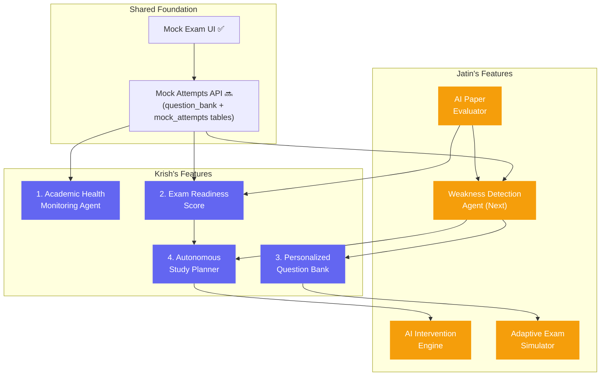

# Krish — Task Roadmap & Dependency Analysis

> **Document Type:** Contributor Task Planning  
> **Audience:** Krish  
> **Based On:** `sutra-ai-work-progress.md` + Codebase Analysis  
> **Last Updated:** 2026-06-13  

---

## Feature Ownership

| Krish (4 features) | Jatin (4 features) | Shared / Already Started |
|---|---|---|
| Academic Health Monitoring Agent | Weakness Detection Agent | ✅ Dynamic Mock Test Generator |
| Autonomous Study Planner | AI Intervention Engine | 🔜 Backend Question Bank API |
| Exam Readiness Score | AI Paper Evaluator | 🔜 Mock Attempt API |
| Personalized Question Bank | Adaptive Exam Simulator | |

---

## Full Dependency Graph



---

## Recommended Implementation Order

### Phase 1 🔥 Start NOW — No Blockers

#### 1. Academic Health Monitoring Agent

| Aspect | Detail |
|--------|--------|
| **Dependencies** | **None on Jatin.** Needs mock student data only. |
| **What to build** | Dashboard widget showing scores, study time, revision frequency. Use hardcoded mock data initially (same pattern as the existing mock exam uses for questions). |
| **Backend needed** | `GET /api/health/{student_id}` endpoint → new route + `student_health` table |
| **Why first** | Gets you productive immediately. Completely independent. Validates the pattern of connecting dashboard widgets to real APIs. |
| **Code location** | New component in `frontend/components/dashboard/` + new route in `backend/app/routes/` |
| **Status** | 🟢 **Can start right now** |

---

### Phase 2 ⏳ After Shared Mock Attempts API is built

#### 2. Exam Readiness Score

| Aspect | Detail |
|--------|--------|
| **Dependencies** | Needs **mock attempt data** (shared infra — not Jatin-specific). Weakness Detection is partially needed for "weak chapters" input, but v1 can work without it. |
| **What to build** | Derive readiness score from mock accuracy + syllabus coverage. The roadmap says: *"Derive readiness from mock accuracy, coverage, and weak chapters"* — weak chapters can be a v2 enhancement. |
| **Backend needed** | `GET /api/readiness/{student_id}` → scores table or computed query |
| **Cross-dependency** | ✅ **Unblocks Jatin:** Jatin's **AI Paper Evaluator** depends on Exam Readiness Score (roadmap shows `Paper → Readiness`). So shipping this unblocks Jatin too. |
| **Status** | 🟡 **Ready once mock attempt tables exist** |

---

### Phase 3 🔗 After Jatin Ships Weakness Detection

#### 3. Personalized Question Bank

| Aspect | Detail |
|--------|--------|
| **Dependencies** | 🔴 **BLOCKED on Jatin's Weakness Detection Agent** |
| **Why blocked** | Can't recommend questions without knowing what the student is weak at. The roadmap explicitly shows: `Weakness → QuestionBank` |
| **What it needs** | Weakness data (concept + severity per student) → then filters/ranks questions from the bank targeting those weak areas |
| **Backend needed** | `GET /api/questions/recommended/{student_id}` |
| **Also feeds into** | Jatin's Adaptive Exam Simulator (`QuestionBank → Adaptive`) |
| **Status** | 🔴 **Blocked until Weakness Detection ships** |

---

### Phase 4 🏁 Last — Most Dependencies

#### 4. Autonomous Study Planner

| Aspect | Detail |
|--------|--------|
| **Dependencies** | 🔴 **BLOCKED on BOTH Jatin (Weakness Detection) + Krish's own Exam Readiness Score** |
| **Why blocked** | The roadmap shows: `Weakness → Planner` AND `Readiness → Planner`. Needs student's weak areas + current readiness + exam dates + available hours. |
| **What to build** | Takes weakness data + readiness score + study hours input → generates daily study plans. Likely needs Gemini AI integration. |
| **Backend needed** | `POST /api/planner/generate` with AI/Gemini integration |
| **Status** | 🔴 **Blocked until Phase 2 + Jatin's Weakness Detection ship** |

---

## Summary Table

| Order | Feature | Depends On | Unlocks For |
|-------|---------|-----------|-------------|
| **1** | 🔥 Academic Health Monitoring Agent | Nothing | Validates API pattern |
| **2** | ⏳ Exam Readiness Score | Shared mock attempts infra | **Jatin's Paper Evaluator** |
| **3** | 🔗 Personalized Question Bank | **Jatin's Weakness Detection** 🔴 | Jatin's Adaptive Simulator |
| **4** | 🏁 Autonomous Study Planner | Weakness Detection + Readiness Score | Jatin's Intervention Engine |

---

## What Krish Can Build RIGHT NOW

Since the shared mock attempt backend doesn't exist yet and Jatin's Weakness Detection isn't built, you can immediately:

1. **Start the Academic Health Monitoring Agent** (Phase 1) — create backend table + API + dashboard widget with mock data
2. **Design the Exam Readiness Score formula** — architect the scoring algorithm on paper/notion, build the schema, wire it up once mock attempts API lands
3. **Design the Question Bank schema** — plan `question_sources`, `questions`, `question_options`, `question_tags` tables. This is actually **shared infrastructure** that both you and Jatin need. The README lists it as "Shared"

---

## What Requires Jatin to Ship First

| Krish Feature | Blocked By |
|--------------|-----------|
| Personalized Question Bank | Jatin's Weakness Detection Agent |
| Autonomous Study Planner | Jatin's Weakness Detection Agent |

---

## What Krish Shipping Unblocks for Jatin

| Krish Feature | Unlocks For Jatin |
|--------------|-------------------|
| Exam Readiness Score | Jatin's AI Paper Evaluator |

This is a **bidirectional dependency** — Jatin needs Krish's Readiness Score for his Paper Evaluator, and Krish needs Jatin's Weakness Detection for Question Bank + Study Planner.

---

## Task Status Tracker

```
Krish Tasks:

[ ] 1. Academic Health Monitoring Agent   — 🟢 No blockers, start now
[ ] 2. Exam Readiness Score               — 🟡 Needs shared mock attempts API
[ ] 3. Personalized Question Bank         — 🔴 Blocked by Jatin (Weakness Detection)
[ ] 4. Autonomous Study Planner           — 🔴 Blocked by Jatin + own Phase 2
```

> **End of Krish Task Roadmap**
