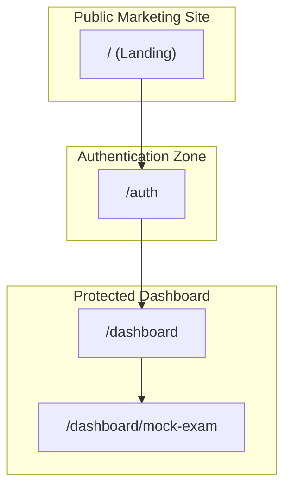
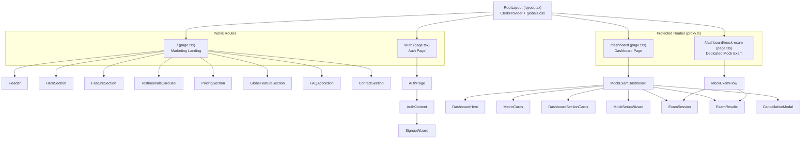
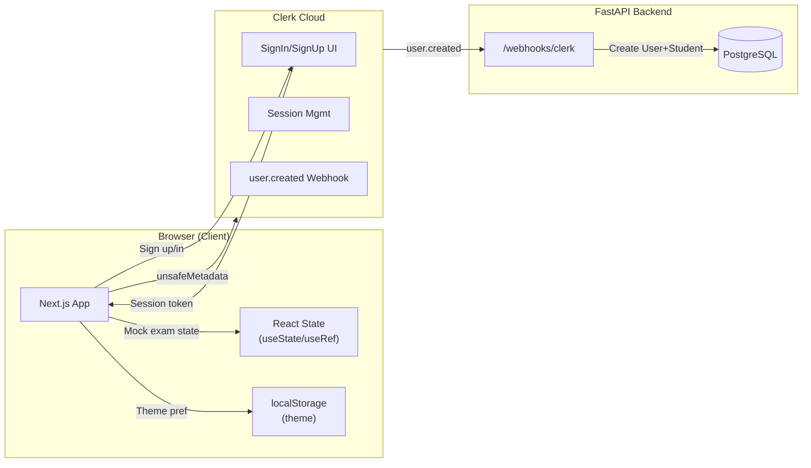
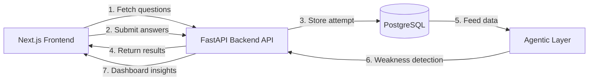
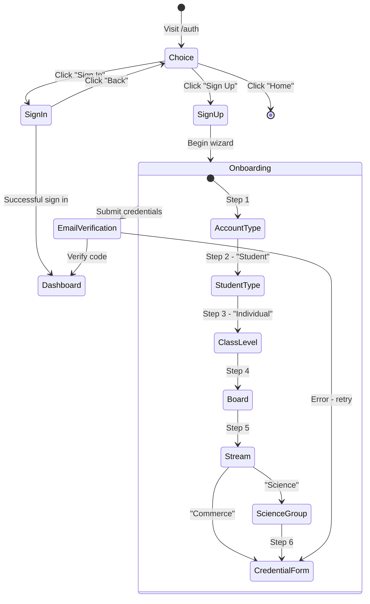
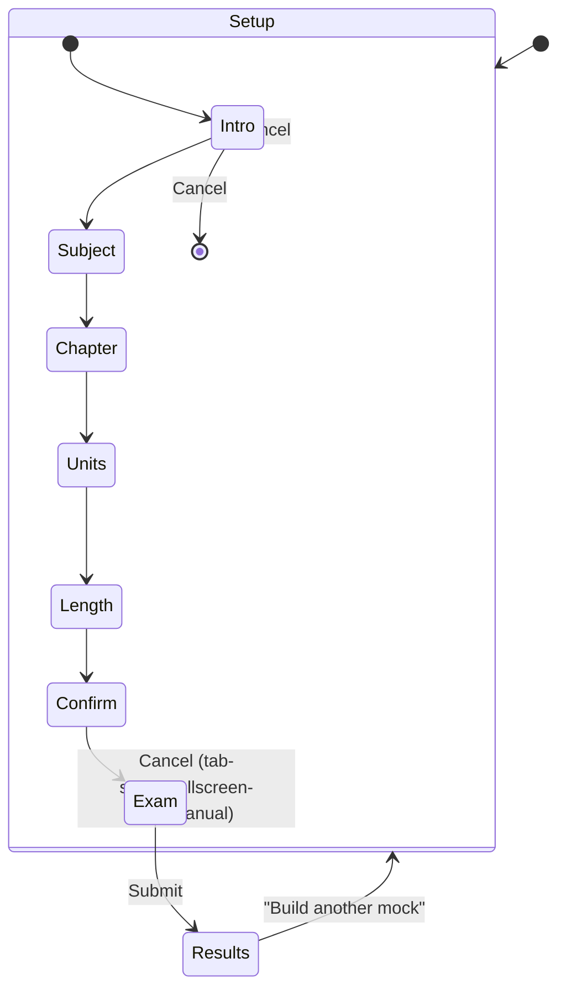
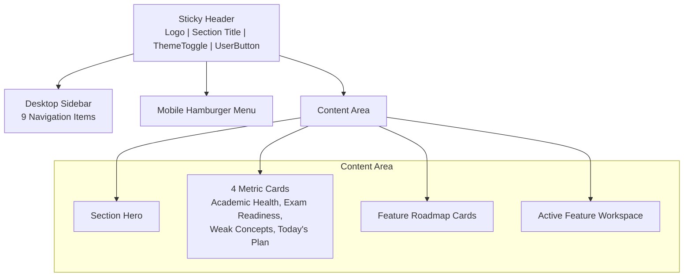

# Sutra AI — Frontend Architecture Document

> **Document Type:** Engineering Architecture Deep-Dive  
> **Audience:** Senior Engineers, System Designers, New Contributors  
> **Version:** 1.0  
> **Last Updated:** 2026-06-13  

---

## Table of Contents

1. [System Overview](#1-system-overview)
2. [Technology Stack](#2-technology-stack)
3. [Project Structure Map](#3-project-structure-map)
4. [Module Architecture & Component Tree](#4-module-architecture--component-tree)
5. [Routing Architecture](#5-routing-architecture)
6. [Data Flow Architecture](#6-data-flow-architecture)
7. [Authentication & Onboarding Flow](#7-authentication--onboarding-flow)
8. [Mock Exam Module Deep-Dive](#8-mock-exam-module-deep-dive)
9. [Dashboard Feature Hub](#9-dashboard-feature-hub)
10. [Marketing Site Pages](#10-marketing-site-pages)
11. [UI Component Library](#11-ui-component-library)
12. [Styling Architecture](#12-styling-architecture)
13. [Key Design Patterns](#13-key-design-patterns)
14. [Build & Deployment](#14-build--deployment)
15. [Contributor Guidelines](#15-contributor-guidelines)

---

## 1. System Overview

Sutra AI Frontend is a **Next.js 16 App Router** application built with **React 19** and **TypeScript**. It serves as the student-facing interface for an autonomous AI-powered exam-preparation and academic-monitoring platform.



### Core Responsibilities

1. **Marketing Landing Page** — Product showcase with hero, features, testimonials, pricing, FAQ, contact
2. **Authentication & Onboarding** — Clerk-powered auth with custom multi-step onboarding wizard
3. **Protected Dashboard** — Feature hub with 9 planned agentic/exam features
4. **Dynamic Mock Exam** — Full exam simulation with timer, fullscreen lock, question navigator, results

---

## 2. Technology Stack

| Layer | Technology | Purpose |
|-------|-----------|---------|
| **Framework** | Next.js 16.2.7 (App Router) | Routing, SSR, middleware |
| **Language** | TypeScript 5.8 | Type safety |
| **UI Library** | React 19 | Component rendering |
| **Auth** | @clerk/nextjs 7.5.1 | Authentication, user management |
| **Styling** | Tailwind CSS 4.1 | Utility-first CSS |
| **Animation** | motion (framer-motion v12) | Scroll reveals, micro-interactions |
| **UI Primitives** | @base-ui/react 1.5 | Accessible headless UI (Input, Avatar, NavMenu) |
| **Icons** | lucide-react 0.546 | Icon library |
| **3D Graphics** | cobe 2.0 | Interactive globe visualization |
| **CSS Components** | shadcn/ui (base-nova style) | Component registry via shadcn |
| **Class Utilities** | clsx + tailwind-merge + class-variance-authority | Conditional styling |
| **Typography** | @fontsource-variable/geist | Geist Variable font |
| **Build** | esbuild 0.25 | Build tooling |

---

## 3. Project Structure Map

```
frontend/
├── app/                              # Next.js App Router pages
│   ├── globals.css                   # Global styles, Tailwind imports, CSS variables
│   ├── layout.tsx                    # Root layout — ClerkProvider wrapper
│   ├── page.tsx                      # Landing/marketing page
│   ├── auth/
│   │   └── page.tsx                  # Auth route — delegates to AuthPage component
│   └── dashboard/
│       ├── page.tsx                  # Dashboard route — MockExamDashboard
│       └── mock-exam/
│           └── page.tsx              # Dedicated mock exam route — MockExamFlow
│
├── components/
│   ├── ui/                           # Atomic UI primitives (shadcn-style)
│   │   ├── avatar.tsx               # Avatar with group/fallback support
│   │   ├── button.tsx               # CVA-based button with variants
│   │   ├── input.tsx                # Base UI input wrapper
│   │   ├── input-group.tsx          # Composed input + addon + button
│   │   ├── textarea.tsx             # Textarea with field-sizing
│   │   ├── navigation-menu.tsx      # Base UI navigation menu
│   │   ├── testimonial.tsx          # Testimonial card
│   │   ├── scroll-reveal-text.tsx   # Scroll-triggered text animation
│   │   └── globe-feature-section.tsx # Cobe globe + CTA section
│   │
│   ├── blocks/                       # Composed block components
│   │   └── testimonials-columns-1.tsx # Animated scrolling testimonials
│   │
│   ├── icons/                        # SVG icon components
│   │   ├── google-icon.tsx
│   │   ├── github-icon.tsx
│   │   └── apple-icon.tsx
│   │
│   ├── dashboard/
│   │   └── mock-exam-dashboard.tsx   # THE CORE FILE — dashboard + mock exam flow
│   │
│   ├── auth-page.tsx                # Auth UI with onboarding wizard
│   ├── theme-toggle.tsx             # Dark/light mode toggle
│   ├── header.tsx                   # Marketing site header
│   ├── hero.tsx                     # Landing hero section
│   ├── feature-section.tsx          # Product feature cards
│   ├── pricing-section.tsx          # B2C/B2B/Enterprise pricing
│   ├── contact-section.tsx          # Contact form
│   ├── faq-accordion.tsx            # FAQ with motion animation
│   ├── testimonials-carousel.tsx    # Testimonial columns display
│   ├── logos-section.tsx            # Trusted-by logo cloud
│   ├── scroll-reveal-concept.tsx    # Philosophy text reveal
│   ├── floating-paths.tsx           # Animated SVG background paths
│   ├── cobe-globe.tsx               # Interactive 3D globe
│   ├── desktop-nav.tsx              # Desktop navigation menu
│   ├── mobile-nav.tsx               # Mobile hamburger menu
│   ├── nav-links.tsx                # Navigation link data
│   ├── logo.tsx                     # SVG logo + wordmark
│   ├── logo-cloud.tsx               # Partner logo images
│   ├── sheard.tsx                   # Shared types (LinkItemType)
│   ├── portal.tsx                   # React portal with body scroll lock
│   ├── auth-divider.tsx             # Section divider
│   └── logo-cloud.tsx               # Partner logos
│
├── hooks/
│   ├── use-theme.ts                 # Theme state management (localStorage + system)
│   └── use-scroll.ts                # Scroll detection with hysteresis
│
├── lib/
│   └── utils.ts                     # cn() utility (clsx + tailwind-merge)
│
├── src/components/shadcn-space/avatar/
│   └── avatar-08.tsx                # Avatar stack component from shadcn-space registry
│
├── assets/
│   └── .aistudio/.gitignore
│
├── proxy.ts                         # Clerk middleware — protects /dashboard(.*)
├── next.config.ts                   # Next.js configuration (minimal)
├── tsconfig.json                    # TypeScript config (path alias @/*)
├── postcss.config.mjs               # PostCSS with @tailwindcss/postcss
├── components.json                  # shadcn/ui configuration
├── package.json                     # Dependencies & scripts
├── .env.example                     # Environment variable template
└── metadata.json                    # AI Studio metadata
```

### File Count Summary

| Category | Count |
|----------|-------|
| App Router pages | 5 |
| UI primitives | 9 |
| Feature components | ~20 |
| Hooks | 2 |
| Utility files | 1 |
| Config files | 7 |
| **Total source files** | **~44** |

---

## 4. Module Architecture & Component Tree

### 4.1 Page-Level Component Hierarchy



### 4.2 Component Dependency Map

```
Layout (app/layout.tsx)
  └── ClerkProvider
       ├── Landing Page (app/page.tsx)
       ├── Auth Page (app/auth/page.tsx)
       ├── Dashboard (app/dashboard/page.tsx)
       └── Mock Exam (app/dashboard/mock-exam/page.tsx)

Header (components/header.tsx)
  ├── Logo
  ├── DesktopNav → NavigationMenu → nav-links
  ├── ThemeToggle
  └── MobileNav → Portal → nav-links

AuthPage (components/auth-page.tsx)
  ├── FloatingPaths (background animation)
  ├── Logo
  ├── Button, Input (ui/)
  ├── SignIn (Clerk)
  ├── useSignUp (Clerk legacy)
  └── WizardOptions

MockExamDashboard (components/dashboard/mock-exam-dashboard.tsx)
  ├── UserButton (Clerk)
  ├── ThemeToggle
  ├── Logo
  ├── Button (ui/)
  ├── MobileNav + DesktopNav sidebar
  ├── MockSetupWizard (inline)
  ├── Exam Session UI (inline)
  ├── Results + Review UI (inline)
  └── MockCancellationModal (inline)
```

---

## 5. Routing Architecture

### 5.1 Route Table

| Path | File | Auth | Purpose |
|------|------|------|---------|
| `/` | `app/page.tsx` | Public | Marketing landing page |
| `/auth` | `app/auth/page.tsx` | Public | Sign in / Sign up + onboarding |
| `/dashboard` | `app/dashboard/page.tsx` | Protected | Dashboard feature hub |
| `/dashboard/mock-exam` | `app/dashboard/mock-exam/page.tsx` | Protected | Dedicated mock exam flow |

### 5.2 Middleware Protection (`proxy.ts`)

```typescript
// Pattern: Protects /dashboard/* routes via Clerk middleware
const isProtectedRoute = createRouteMatcher(["/dashboard(.*)"]);

// Export as default clerkMiddleware — Next.js picks this up automatically
// Matcher excludes static assets, _next, common files
```

**Protection behavior:**
- `/dashboard(.*)` → requires authenticated session
- `/`, `/auth`, static assets → public
- Sign-in/sign-up redirect on unauthenticated access → `/dashboard`
- Uses Clerk's `auth.protect()` for robust session validation

---

## 6. Data Flow Architecture

### 6.1 Current Data Flow (MVP)



**Key observation:** Currently, the frontend operates entirely on **client-side state** for mock exams. No backend API is called during exam flow. This is an MVP constraint — the mock questions are hardcoded, answers are evaluated client-side, and results are ephemeral (lost on page refresh).

### 6.2 Planned Data Flow (Post-MVP)



---

## 7. Authentication & Onboarding Flow

### 7.1 Auth State Machine



### 7.2 Onboarding Metadata Contract

```typescript
type OnboardingState = {
  role: "student";
  student_type: "individual";
  class_level?: "10th" | "12th";
  board?: "CBSE";                       // GSEB, ICSE — coming soon
  stream?: "science" | "commerce";
  science_group?: "pcb" | "pcm" | "pcmb"; // Only for science
  onboarding_complete: true;
};
```

### 7.3 Security Considerations

- `unsafeMetadata` is **client-writable** — backend derives `onboarding_complete` server-side
- Clerk CAPTCHA is mounted via `<div id="clerk-captcha" />` for bot protection
- Backend validates allowed values for class_level, board, stream, science_group

---

## 8. Mock Exam Module Deep-Dive

### 8.1 Overview

The Mock Exam module is the most complex piece of the frontend. It lives in `components/dashboard/mock-exam-dashboard.tsx` (~1700+ lines) as a **monolithic client component** that handles:

1. Dashboard display
2. Exam setup wizard
3. Full exam session
4. Results and answer review
5. Cancellation handling

### 8.2 Exam State Machine



### 8.3 Exam Setup Steps

| Step | Component | Action | User Choice |
|------|-----------|--------|-------------|
| 1. Intro | `MockSetupWizard` | Start | Begin flow |
| 2. Subject | Subject selector | Choose | Physics / Chemistry / Maths |
| 3. Chapter | Chapter selector | Choose | Electrostatics / Calculus / etc. |
| 4. Units | Unit checkboxes | Toggle | Select specific units |
| 5. Length | Length selector | Choose | Short (3 Qs, 15m) / Standard (5 Qs, 35m) / Full (8 Qs, 60m) |
| 6. Confirm | Confirmation screen | Confirm | Verify + Start |

### 8.4 Question Selection Algorithm

```
1. Filter questions by: subjectId, chapterId, unitId (or all units if none selected)
2. Sort by composite score: frequency * 0.4 + importance * 0.4 + difficulty_weight * 0.2
3. Slice top N according to exam length
```

### 8.5 Exam Security Features

- **Fullscreen enforcement**: `document.documentElement.requestFullscreen()` on start
- **Tab-switch detection**: `visibilitychange` event → cancels exam
- **Fullscreen-exit detection**: `fullscreenchange` event → cancels exam
- **Beforeunload guard**: Prevents accidental tab close during exam
- **AllowFullscreenExitRef**: Safe flag for controlled fullscreen exit

### 8.6 Question Data Structure

```typescript
type Question = {
  id: string;
  subjectId: string;
  chapterId: string;
  unitId: string;
  prompt: string;
  options: string[];
  answerIndex: number;
  explanation: string;
  frequency: number;      // PYQ appearance frequency %
  importance: number;     // Exam importance score %
  difficulty: "Easy" | "Medium" | "Hard";
  sourceYears: number[];  // Years this question appeared
};
```

The question bank is **hardcoded** with 10 questions across 3 subjects and 6 chapters. This is an MVP placeholder — planned to be served from the backend question bank.

### 8.7 Timer Architecture

```typescript
useEffect(() => {
  if (mode !== "exam") return;
  if (remainingSeconds <= 0) { completeExam(); return; }
  const timerId = window.setTimeout(() => {
    setRemainingSeconds((current) => Math.max(0, current - 1));
  }, 1000);
  return () => window.clearTimeout(timerId);
}, [mode, remainingSeconds]);
```

- Timer countdown using `setTimeout` (not `setInterval`) for accuracy
- Auto-submits when time reaches 0
- Warning color change at ≤5 minutes
- Timer is reset on exam start/cancel

### 8.8 Results Calculation

```typescript
const result = calculateResult(examQuestions, answers);
// Returns: { correct, incorrect, skipped, attempted, percentage }
```

Results are computed **client-side** — no persistence to backend yet.

### 8.9 Two Entry Points

The mock exam has **two rendering paths**:

| Entry Point | Route | Component | Behavior |
|-------------|-------|-----------|----------|
| Dashboard card | `/dashboard` | `MockExamDashboard` | Embedded setup → inline exam → result panel |
| Dedicated page | `/dashboard/mock-exam` | `MockExamFlow` (exported separately) | Standalone full-screen flow |

Both share the same logic but render differently — `MockExamDashboard` keeps the dashboard chrome, `MockExamFlow` is a focused exam experience.

---

## 9. Dashboard Feature Hub

### 9.1 Dashboard Layout



### 9.2 Feature Roadmap Cards

| # | Feature | Owner | Status | Icon |
|---|---------|-------|--------|------|
| 1 | Academic Health Monitoring | Krish | Planned | HeartPulse |
| 2 | Weakness Detection Agent | Jatin | **Next** | BrainCircuit |
| 3 | Autonomous Study Planner | Krish | Planned | CalendarClock |
| 4 | AI Intervention Engine | Jatin | Planned | ShieldAlert |
| 5 | **Dynamic Mock Test Generator** | Shared | **Active** | BookOpenCheck |
| 6 | Exam Readiness Score | Krish | Planned | Gauge |
| 7 | AI Paper Evaluator | Jatin | Planned | FileCheck |
| 8 | Personalized Question Bank | Krish | Planned | Database |
| 9 | Adaptive Exam Simulator | Jatin | Planned | WandSparkles |

### 9.3 Navigation System

- **Desktop**: Sticky sidebar with 9 navigation items, icon + short label
- **Mobile**: Hamburger menu → full-screen overlay portal with all sections
- **URL-driven**: `?section=mock` and `?mock_cancelled=` query params manage state across entries
- **Smart active section**: Dashboard defaults to "mock" on load, restores from URL params

---

## 10. Marketing Site Pages

The landing page (`app/page.tsx`) is a comprehensive marketing site with:

### 10.1 Section Breakdown

| Section | Component | Key Elements |
|---------|-----------|-------------|
| Header | `header.tsx` | Sticky nav, desktop/mobile menus, auth CTAs, theme toggle |
| Hero | `hero.tsx` | Animated headline, board alignment badge, avatar stack, app screenshots (light/dark), CTA buttons |
| Logos | `logos-section.tsx` | Trusted-by logo cloud (Vercel, Supabase, OpenAI, Clerk, etc.) |
| Philosophy | `scroll-reveal-concept.tsx` | Scroll-triggered character-by-character text reveal |
| Features | `feature-section.tsx` | 5 feature cards: Health Monitoring, Weakness Detection, Readiness Index, Paper Evaluator, Adaptive Simulator |
| Testimonials | `testimonials-carousel.tsx` | Infinite-scrolling animated testimonial columns |
| Pricing | `pricing-section.tsx` | B2C ($19/mo), B2B Academy ($199/mo), Enterprise ($499/mo) with billing toggle |
| Globe CTA | `globe-feature-section.tsx` | Cobe 3D globe + "Join Today" CTA |
| FAQ | `faq-accordion.tsx` | Motion-animated accordion with 5 questions |
| Contact | `contact-section.tsx` | Contact form (name, email, message) with simulated submission |
| Footer | Inline in page.tsx | Copyright, privacy, terms, contact links |

---

## 11. UI Component Library

### 11.1 Primitive Components (`components/ui/`)

| Component | Base Library | Features |
|-----------|-------------|----------|
| `button.tsx` | Radix Slot + CVA | 6 variants, 4 sizes, asChild polymorphic |
| `input.tsx` | @base-ui/react/input | Styled input with focus/error/disabled states |
| `input-group.tsx` | Custom | Composed input + addons + buttons + textarea |
| `textarea.tsx` | Native | field-sizing-content, dark mode support |
| `avatar.tsx` | @base-ui/react/avatar | Image, fallback initials, group, count |
| `navigation-menu.tsx` | @base-ui/react/nav-menu | Dropdown navigation with positioning |
| `testimonial.tsx` | Custom | Quote card with optional highlight |
| `scroll-reveal-text.tsx` | motion (framer-motion) | Scroll-triggered character/word animation |
| `globe-feature-section.tsx` | cobe | 3D globe + CTA section |

All primitives follow **shadcn/ui style patterns**:
- `cn()` utility for class merging
- CSS variables for theming
- Dark mode via `.dark` class
- Consistent border/radius/ring patterns

### 11.2 Component Registries

From `components.json`:
- **@efferd**: `https://efferd.com/r/{style}/{name}.json` (custom registry)
- **@shadcn-space**: `https://shadcnspace.com/r/{name}.json` (avatar-08 sourced from here)

---

## 12. Styling Architecture

### 12.1 CSS Layer Stack

```
1. tailwindcss              → Base reset + utility classes
2. tw-animate-css           → Animation utilities
3. shadcn/tailwind.css      → shadcn design tokens
4. @fontsource-variable/geist → Geist font
5. globals.css              → Custom theme variables + base layer
```

### 12.2 Theming System

- **CSS Variables**: OKLCH color space for both light and dark themes
- **Dark Mode**: `.dark` class on `<html>`, detected via system preference or toggle
- **Theme Persistence**: `localStorage.getItem("theme")` with system preference fallback
- **Theme Toggle**: `use-theme.ts` hook — manages `theme` state, toggles class, persists to localStorage

### 12.3 Design Token Highlights

```css
:root {
  --background: oklch(1 0 0);      /* White */
  --foreground: oklch(0.145 0 0);  /* Near black */
  --primary: oklch(0.205 0 0);
  --radius: 0.625rem;              /* Base border radius */
}

.dark {
  --background: oklch(0.145 0 0);
  --foreground: oklch(0.985 0 0);
  --border: oklch(1 0 0 / 10%);
}
```

### 12.4 Key Visual Patterns

- **Border-based cards**: `rounded-lg border bg-card p-5 shadow-sm`
- **Glow effects**: `bg-[radial-gradient(...)] blur-[90px]` pointer-events-none
- **Backdrop blur**: `bg-background/90 backdrop-blur supports-[backdrop-filter]:bg-background/70`
- **Micro-interactions**: Hover scale, color transitions, border-highlight on feature cards

---

## 13. Key Design Patterns

### 13.1 State Management Architecture

The frontend uses **React local state** exclusively — no global state library:

| State Type | Mechanism | Locations |
|-----------|-----------|-----------|
| Auth state | Clerk SDK (`useAuth`, `useUser`, `useSignUp`) | Global via ClerkProvider |
| UI state | `useState` | Theme, mobile menu, wizard steps |
| Exam state | `useState` + `useRef` | Questions, answers, timer, mode |
| URL params | `URLSearchParams` | Dashboard section, cancellation reason |
| Persistent state | `localStorage` | Theme preference |

### 13.2 Data Hardcoding

Multiple datasets are hardcoded (MVP decisions for rapid prototyping):

| Data | Location | Planned Source |
|------|----------|---------------|
| Subjects, Chapters, Units | `mock-exam-dashboard.tsx` | Backend API |
| Questions (10 total) | `mock-exam-dashboard.tsx` | PYQ Question Bank |
| Dashboard stats | `mock-exam-dashboard.tsx` | Backend analytics API |
| Dashboard sections config | `mock-exam-dashboard.tsx` | CMS / config |
| Pricing plans | `pricing-section.tsx` | Stripe / CMS |
| Testimonials | `testimonials-carousel.tsx` | CMS / admin panel |
| FAQ data | `faq-accordion.tsx` | CMS |
| Nav link data | `nav-links.tsx` | CMS |

### 13.3 Error Handling Pattern

Clerk errors use a dedicated error extraction utility:

```typescript
function getClerkErrorMessage(err: unknown) {
  const clerkErrors = (err as { errors?: { longMessage?: string; message?: string }[] })?.errors;
  return clerkErrors?.[0]?.longMessage || clerkErrors?.[0]?.message || "Something went wrong.";
}
```

### 13.4 Hook Patterns

```typescript
// useTheme — theme management with hydration safety
export function useTheme() {
  const [theme, setTheme] = useState<Theme>("light");
  const [mounted, setMounted] = useState(false);
  // ... reads localStorage, system preference, toggles class
}

// useScroll — scroll detection with hysteresis
export function useScroll(downThreshold: number, upThreshold?: number) {
  // Prevents flickering by using different thresholds for up/down
}
```

### 13.5 Polymorphic Components

Uses `@radix-ui/react-slot` for `asChild` pattern (e.g., `<Button asChild><Link>...</Link></Button>`), enabling flexible component composition.

---

## 14. Build & Deployment

### 14.1 Scripts

```bash
npm run dev      # next dev --port=3000 --hostname=0.0.0.0
npm run build    # next build
npm run start    # next start --port=3000 --hostname=0.0.0.0
npm run lint     # tsc --noEmit (TypeScript type-check only)
```

### 14.2 Build Pipeline

```
TypeScript → Next.js Build → Static Optimization → Output
  (tsc --noEmit)  (next build)    (automatic for    (server/client
                                   static pages)      components)
```

### 14.3 Environment Variables

```env
NEXT_PUBLIC_CLERK_PUBLISHABLE_KEY=          # Clerk frontend API key
CLERK_SECRET_KEY=                            # Clerk secret key
NEXT_PUBLIC_CLERK_SIGN_IN_FALLBACK_REDIRECT_URL=/dashboard
NEXT_PUBLIC_CLERK_SIGN_UP_FALLBACK_REDIRECT_URL=/dashboard
GEMINI_API_KEY=                              # For Gemini AI features
APP_URL=                                     # Host URL for callbacks
```

---

## 15. Contributor Guidelines

### Do's
- Keep components in `components/` with clear naming
- Use `cn()` utility for conditional classes
- Make new components "use client" only when needed (leverage RSC)
- Keep dashboard UI dark-mode compatible
- Use lucide-react for icons
- Follow shadcn patterns for UI primitives

### Don'ts
- Don't import server-only code in client components
- Don't treat Clerk `unsafeMetadata` as trusted auth data
- Don't commit real `.env` secrets
- Don't add global state managers — local state is sufficient for current complexity
- Don't mutate question data — treat it as read-only

### Code Organization Principles

1. **Page components** (`app/`) are thin — 5 lines max, delegate to `components/`
2. **Feature components** own their full state lifecycle
3. **UI components** are pure/presentational with `cn()` class merging
4. **Hooks** encapsulate reusable browser API interactions
5. **Data** should eventually migrate from hardcoded to API-driven

---

## Appendix A: Hardcoded Data Inventory

| Data | Lines | Type | Owner |
|------|-------|------|-------|
| Subjects (3) + 6 chapters + 18 units | 86-162 | Static array | Shared |
| Questions (10) | 164-305 | Static array | Shared |
| Exam length configs | 307-311 | Static record | Shared |
| Dashboard sections (9) | 313-443 | Static array | Shared |
| Dashboard stats (4) | 445-450 | Static array | Krish |
| Pricing plans (3) | ~60 | Static array | Shared |
| Testimonials (8) | ~40 | Static array | Shared |
| FAQ items (5) | ~25 | Static array | Shared |
| Navigation links (13) | ~40 | Static array | Shared |
| Logo cloud (11) | ~30 | Static array | Shared |

## Appendix B: File Size Analysis

| File | Lines | Complexity |
|------|-------|-----------|
| `mock-exam-dashboard.tsx` | ~1700+ | **High** — co-locates dashboard + exam flow + setup + results |
| `auth-page.tsx` | ~487 | Medium — onboarding wizard + Clerk integration |
| `feature-section.tsx` | ~413 | Medium — 5 feature cards with custom SVGs |
| `pricing-section.tsx` | ~225 | Medium — billing toggle + student count slider |
| All other components | < 200 | Low — presentational or simple logic |

**Note:** `mock-exam-dashboard.tsx` is a prime refactoring candidate. It bundles ~5 distinct concerns (dashboard shell, section routing, exam setup, exam session, results review) into one monolithic file. Recommended split:
- `dashboard-layout.tsx` — Shell with sidebar/nav
- `exam-setup-wizard.tsx` — Multi-step setup
- `exam-session.tsx` — Full-screen exam
- `exam-results.tsx` — Results + review
- `dashboard-home.tsx` — Feature hub with section routing

---

> **End of Frontend Architecture Document**  
> For backend architecture, see `openclaude_backend.md`  
> For merged full-system architecture, see `openclaude_both_repo.md`
